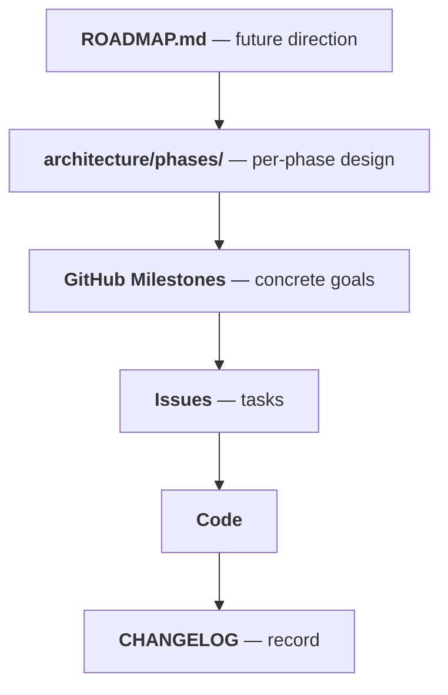

# CAEGraph Roadmap

CAEGraph's strategic plan: what we intend to build, in which order.

This file is the **strategy layer**. The layering is:

Rules of engagement:

- `architecture/ARCHITECTURE.md` §6 is the **binding** phase table; this file is its strategy-facing mirror.
- Agents implement the **current phase only**. Out-of-phase ideas go to the corresponding phase backlog (see `.agent/skills/project_management/SKILL.md`).
- Statuses: `Planned` → `In progress` → `Done`.

---

## Vision

CAEGraph bridges CAE simulation and physics AI through a **CAE → GNN → AI workflow** — normalizing heterogeneous CAE data into **CAEGraph**, the graph-native canonical domain representation (ADR-015), enabling GNN training on engineering problems through a backend adapter, running neural simulation across different discretizations with pretrained models, and correcting predictions with experimental observations (ADR-008).

---

## Phase 0 — Foundation · `Done`

Establish the project skeleton so that everything later is architecture-gated.

- [x] src-layout package + `pyproject.toml`
- [x] Architecture spec, dual UML system, ADRs
- [x] Agent governance (`.agent/`: workflow, skills, validation)
- [x] Bilingual MkDocs site (Material + i18n + mkdocstrings)
- [x] pytest framework + pre-commit + GitHub CI
- [x] First clean end-to-end run in `caegraph-dev` (install → pytest → docs build)

Details: [`architecture/phases/phase0-foundation.md`](architecture/phases/phase0-foundation.md)

## Phase 1 — Core Data Structures · `Done`

Fundamental abstractions in `caegraph.core`: `BaseObject`, registries, shared types. First Generated UML produced by tooling.

Details: [`architecture/phases/phase1-core.md`](architecture/phases/phase1-core.md)

## Phase 2 — CAE Data Pipeline · `In progress`

**R1** — the `caegraph.core` domain core: **CAEGraph**, the graph-native canonical domain representation (ADR-015), with the topology subsystem (`Mesh`/`CellType` for cell-based discretizations), `Field`, and boundary vocabulary; plus the data band: `caegraph.geometry`/`caegraph.io`/`caegraph.graph`/`caegraph.transforms`/`caegraph.dataset` — CAE loading (gmsh first) via source normalization into canonical topology, representation construction (construction contract: ADR-016, proposed), the backend adapter (CAEGraph → PyG Data in Phase 2; adaptation contract: ADR-017, proposed), transforms (BC encoding), CAEDataset, VTK write-back. Conversion invariants (topology, conservation, boundary mapping) scientifically validated. Before Phase 3, benchmark the canonical data layout (memory usage, graph construction, neighbor query, CAEGraph→PyG conversion) — CAEGraph is optimized for domain representation and data interoperability, not for replacing general graph algorithm libraries (ADR-015).

Details: [`architecture/phases/phase2-cae-data.md`](architecture/phases/phase2-cae-data.md)

## Phase 3 — Machine Learning Interface · `Planned`

**R2 + R4** — `caegraph.physics` (losses/constraints), `caegraph.models` (Model interface + utilities, no GNN zoo), `caegraph.assimilation` (observation/correction), `caegraph.workflow` (loss assembly, batch adaptation — no fit loop); end-to-end training on synthetic benchmarks with user-provided loops, incl. observation-constraint mode.

Details: [`architecture/phases/phase3-ml-models.md`](architecture/phases/phase3-ml-models.md)

## Phase 4 — Neural Simulation & Release · `Planned`

**R3** — `caegraph.inference` (simulator + rollout harness, numerics model-side), VTK write-back closed loop, examples (concrete model architectures live outside the library); API freeze, packaging polish, v1.0.

Details: [`architecture/phases/phase4-release.md`](architecture/phases/phase4-release.md)
