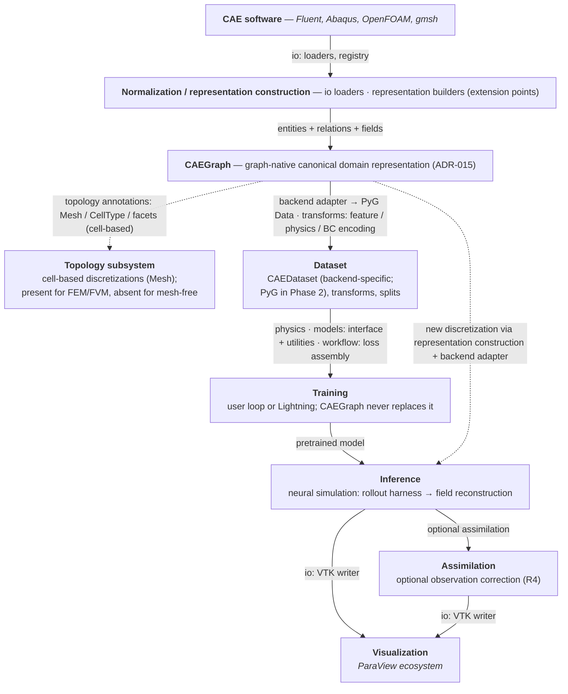
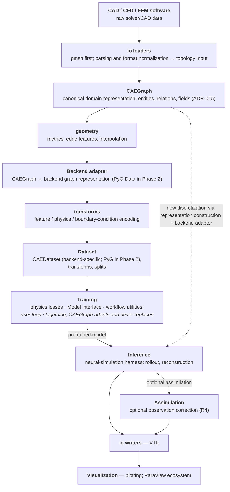
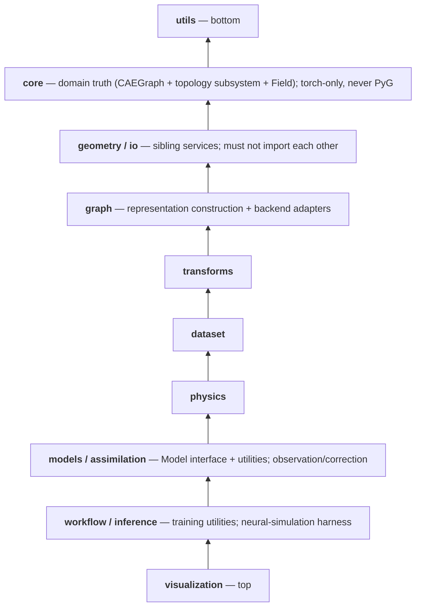
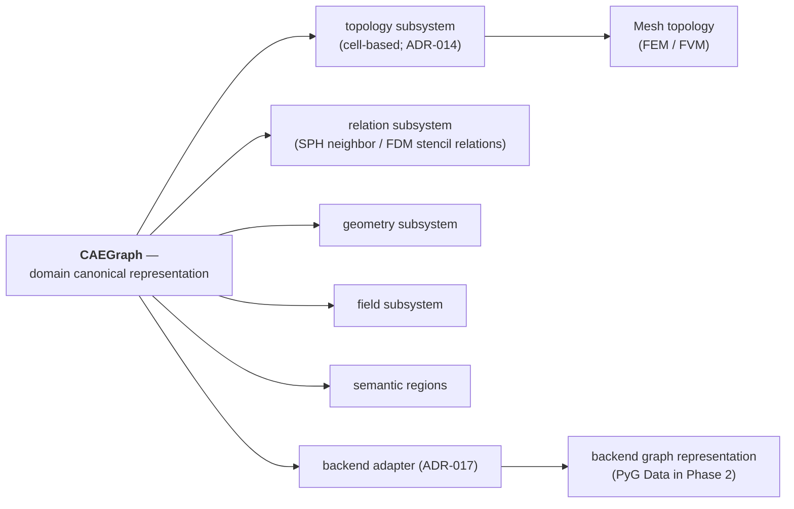
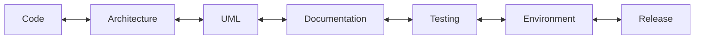

# CAEGraph Architecture Specification

> This document is the single source of truth for the software architecture of CAEGraph. **Every contributor — human or AI agent — MUST read this document before writing any code.**

---

## 1. Project Vision

CAEGraph is a Python framework that bridges CAE simulation and physics AI through a **CAE → GNN → AI workflow**: it normalizes heterogeneous CAE simulation data — meshes, grids, particles, fields, boundary conditions, physics metadata — into **CAEGraph**, the graph-native canonical domain representation (ADR-015), enables GNN training on engineering problems through the backend adapter (CAEGraph → backend graph data; PyG is one backend and defines no domain objects), runs neural simulation across different discretizations with pretrained models, and corrects predictions with experimental observations. It **extends** the [PyTorch Geometric (PyG)](https://pyg.org) ecosystem for computational engineering without coupling its domain model to it.

> **Mesh is one way to construct CAEGraph, not the definition of CAEGraph. PyG is one way to execute CAEGraph for GNN training, not the definition of CAEGraph.** (ADR-015)

Four core requirements (frozen, ADR-008):

- **R1** — CAE data → GNN training data (parsing, topology, features, fields, boundary encoding).
- **R2** — GNN training workflows adapted to CAE data (not a training framework).
- **R3** — any discretization + a pretrained GNN → neural simulation (the AI counterpart of the CAE workflow).
- **R4** — experimental-data assimilation (e.g. PIV sparse measurements correcting dense predictions).

Normalization is format-specific; representation construction covers cell-based meshes (FEM/FVM), grids (FDM), and particles (SPH) as source specializations (ADR-015) — construction contracts are defined in ADR-016 (proposed). The **topology subsystem is present for cell-based discretizations and absent for mesh-free ones** — its composition depends on the source discretization.

Long-term goals:

- A stable, public, PyPI-installable scientific library — **not** a script collection.
- First-class support for representation construction from cell-based meshes (node graphs, cell graphs), grids, and particle discretizations into the canonical CAEGraph (ADR-015).
- CAE-aware model utilities on top of the canonical representation and its backend adapters; the library never locks users into one training paradigm and never becomes a GNN zoo (ADR-008).
- Reproducible, tested, documented — everything an open-source scientific project requires.

Non-goals (explicitly out of scope):

- CAEGraph is **not** a mesh generator and **not** a CFD/FEA solver.
- CAEGraph is **not** a training framework: no Trainer/optimizer/ distributed engines (ADR-008); training loops belong to users (PyTorch / Lightning).
- CAEGraph does not implement solver numerics (time-integration schemes); the inference layer provides workflow harnesses only (ADR-007 D5).
- CAEGraph does not reimplement PyG; it reaches the PyG ecosystem through the backend adapter (ADR-008, ADR-015) while keeping its engineering truth (CAEGraph, topology subsystem, Field, Boundary) framework-free.

---

## 2. Design Philosophy

1. **Modular design** — each subpackage has one responsibility; cross-package dependencies only point "downward" (models → dataset → core, never core → models).
2. **Reusable components** — building blocks (transformations, losses, encoders) are small, composable, and independent of specific solvers or file formats.
3. **Clear abstraction** — every public class implements an explicit abstraction documented in the design UML; no implicit interfaces, no god objects.
4. **API stability** — anything exported in `caegraph.__init__` or documented in the API reference is a public contract. Breaking changes require a changelog entry, a deprecation cycle, and a major-version bump.
5. **Documentation consistency** — every public module, class, and function has a docstring; docs are generated from code (mkdocstrings), so documentation drift is a bug, not a nuisance.

---

## 3. Core Architecture

### 3.1 Processing pipeline

The framework is organized around the canonical data flow:

### 3.2 Package map

| Package | Responsibility | Depends on |
| --- | --- | --- |
| `caegraph.utils` | logging and reproducibility helpers | (nothing internal) |
| `caegraph.core` | domain truth: BaseObject, CAEGraph (canonical domain representation), topology subsystem (Mesh, cell-based), Field; boundary vocabulary; registries; shared enums | utils (torch allowed, PyG forbidden) |
| `caegraph.geometry` | geometric services: metrics, edge features, interpolation | core |
| `caegraph.io` | loaders (gmsh first) and writers (VTK); format registry | core |
| `caegraph.graph` | representation construction (source discretization → CAEGraph; contracts in ADR-016) + backend adapters (CAEGraph → backend graph data; PyG backend in Phase 2; ADR-017) | core, geometry |
| `caegraph.transforms` | geometry / feature / physics transforms (BC encoding) on PyG Data | graph |
| `caegraph.dataset` | CAEDataset: collections, splits (backend-specific; PyG Dataset in Phase 2) | graph, transforms |
| `caegraph.physics` | PDE residuals, physics losses, constraints | core, graph |
| `caegraph.models` | Model interface + CAE-aware utilities (no GNN zoo) | core, graph, physics |
| `caegraph.assimilation` | observation / correction operators (R4) | core, graph, physics |
| `caegraph.workflow` | training utilities: loss assembly, CAE batch adaptation (no fit loop) | physics, models, assimilation, dataset |
| `caegraph.inference` | neural-simulation harness: simulator, rollout loop (numerics model-side) | core, graph, transforms, models, assimilation, io |
| `caegraph.visualization` | discretization/field/graph plotting | core, graph, io |

Dependency layers (lower layers must never import higher layers; same-layer imports are forbidden):

Notes on `physics` placement:

- `physics` sits **below** `models` deliberately: physics-informed models (e.g. a PINN model in `models`) consume PDE residuals and physics losses from `physics` (e.g. a `PhysicsLoss`), never the reverse.
- `physics` depends only on `core`/`utils` (plus `graph` for graph-structured inputs); it must never import `models`.
- PyG boundary: `torch_geometric` may be imported from `caegraph.graph` upward; `core`/`geometry`/`io` never import it (ADR-007 D2).
- `assimilation` is consumed in two modes: by `workflow` (training-constraint mode — observation loss terms) and by `inference` (post-prediction correction).
- If future physics-informed learning needs force a richer structure, the preferred evolution is splitting `physics` into submodules (`equations`, `constraints`, ...) inside the same layer — recorded via an ADR — not reordering the layers.
- No circular imports, ever.
- The graph layer currently contains two logically separate responsibilities: representation construction (source → domain; ADR-016) and backend adaptation (domain → backend; ADR-017). These are independent concerns — construction strategies must not leak into adapters or the reverse — and they must not introduce a dependency from core to graph.
- Only truly cross-domain logic may live in `utils`; single-domain logic stays inside its own subpackage.
- "Garbage drawer" modules (`helper.py`, `common.py`, `misc.py`, `*_utils.py`) require Architecture Agent approval. Domain-scoped tool modules inside their owning subpackage (e.g. plotting helpers inside `visualization`) are fine.

### 3.3 UML dual system

- **Design UML** (`architecture/design/*.puml`) — the *planned* design, maintained by the Architecture agent. Changes here precede code changes.
- **Generated UML** (`diagrams/generated/`) — the *actual* state of the code, generated from source. It never diverges silently from reality.

See `architecture/UML_GUIDE.md`. The two must be reconciled regularly; divergence is treated as technical debt.

### 3.4 Representation and inheritance contracts

- Representation construction follows ADR-016 and is currently grouped in the graph layer for Phase 2 implementation; package ownership is not frozen. Representation builders map source discretizations (mesh / grid / particles) onto a `CAEGraph` (ADR-015). Mesh is one way to construct CAEGraph, not the definition of CAEGraph. Construction contracts are defined in ADR-016 (proposed); builder APIs, class names, registry, and module layout are deliberately not frozen. The topology subsystem (`Mesh`) does not provide a `to_graph()` conversion method because topology objects do not own representation construction logic — construction is handled by representation builders (ADR-016). The dependency rule remains that core never imports graph (ADR-007).
- Backend conversion is owned by a backend adapter: `CAEGraph → framework-specific graph representation`, with PyG as one backend implementation (PyG Data in Phase 2). **DataGraph is the conceptual name of the backend representation layer** (ADR-017, proposed) — not a required class and not a domain object; it owns **no domain semantics** (no boundary semantics, CellType, physical regions, or mesh topology truth). `Graph` is **not** a domain class, and CAEGraph has **no source-type subclasses** (no MeshGraph/GridGraph/ParticleGraph — construction varies by strategy, not by type hierarchy).
- `BaseObject` is the common base for the domain object family — `CAEGraph`, topology objects (`Mesh`), and `Field`. It is not a base for learning-layer objects.
- `CAEDataset` and `Model` remain **backend-specific**: they inherit `torch_geometric.data.Dataset` and `torch.nn.Module` respectively. These are the current Phase 2 implementation choices (PyG), not a frozen contract — the backend adapter layer is the seam for alternative backends, which require architecture review only when they change the domain/backend boundary or the dependency direction (ADR-017).
- These contracts are binding under ADR-009 as amended by ADR-015.

### 3.5 Representation hierarchy (ADR-015)

CAEGraph is the single domain canonical representation; topology / relation / geometry / field / regions are its semantic subsystems, and their composition depends on the source discretization — the topology subsystem is present and first-class for cell-based methods and absent for mesh-free ones, where generated adjacency relations take its place. CAEGraph has no source-type subclasses (ADR-015); construction mechanisms are defined in ADR-016, backend adaptation in ADR-017. **Subsystem relationships describe semantic composition, not Python inheritance** — `Mesh` is not a `CAEGraph` subclass.

### 3.6 Representation terminology

| Term | Meaning |
| --- | --- |
| CAEGraph | domain canonical representation (ADR-015) |
| Source representation | external CAE discretization form (mesh / grid / particles) — not domain truth |
| Topology subsystem | cell-based discretization semantics (ADR-014); semantic attachment, not inheritance |
| Representation builder | source → CAEGraph construction strategy (ADR-016); not a domain object |
| Backend adapter | CAEGraph → backend graph data (ADR-017) |
| DataGraph | conceptual name of the backend representation layer — not a required class |
| PyG Data | Phase 2 backend object (`torch_geometric.data.Data`) |
| Graph (domain class) | forbidden; use CAEGraph for the domain model |

Generic graph vocabulary (graph theory, graph construction, graph algorithms) is unaffected by this restriction — what is forbidden is a **domain class named `Graph`**, not the word "graph".

---

## 4. Coding Rules

### 4.1 Language & style

- Python ≥ 3.10, type hints on all public APIs. The canonical development environment is Python 3.10 (ADR-003); CI verifies every supported minor version including 3.11.
- Formatting via **black**; linting via **ruff** (config in `pyproject.toml`).
- Line length 88.

### 4.2 Structure rules

- All source lives in `src/caegraph/` (src-layout). **No Python files in the repository root**, ever.
- No single-file scripts as core functionality; no throwaway tool scripts in the repository.
- Every module has exactly one clear responsibility, stated in its docstring.
- No duplicated code: three similar lines are better than a premature abstraction, but real duplication must be factored into the correct existing module — **not** into a new `helpers.py`.
- Do not create helper/util files on a whim; utilities belong in `caegraph.utils` with a stated responsibility.
- Functionality must not be scattered: a feature lives in its designated subpackage per the package map above.

### 4.3 Documentation rules

- Every **public class** has a docstring (purpose, responsibilities, usage).
- Every **public function/method** has a docstring with Args/Returns/Raises.
- Every **module** has a docstring stating its responsibility.
- Docstrings feed the generated API docs — write them for users.

### 4.4 Testing rules

- Every public behavior gets a test in `tests/`, mirroring the `src/` layout.
- Tests must not depend on network access or huge CAE files; use small synthetic fixtures.
- A change without tests is incomplete.

### 4.5 Compatibility rules

- Do not pin exact dependency versions in `pyproject.toml`; use lower bounds.
- Keep the package PyPI-publishable at all times.
- Compatibility mechanisms (legacy namespaces, deprecation shims, compat re-exports) require a real, previously released or ADR-frozen public API. Never invent backward compatibility for APIs that never existed — no pre-release `legacy`/`deprecated`/`compat` baggage.

---

## 5. Agent Development Rules

All code agents (human or AI) MUST follow this workflow **before writing code**:

1. **Read `architecture/ARCHITECTURE.md`** (this file) and the relevant `.agent/skills/*/SKILL.md` for your role.
2. **Check existing UML** — inspect `architecture/design/*.puml` (design) and `diagrams/generated/` (current reality). Never invent an abstraction that is not in the design UML.
3. **Modify the design first** — if a change affects structure, update the design UML and get it reviewed *before* coding. Code follows design; design never retro-fitted to code.
4. **Synchronize documentation and tests** — a code change is complete only when docstrings, MkDocs pages, the CHANGELOG, and tests are updated together.

Additionally:

- Respect the Phase gates: do not implement features outside the current phase. The binding table lives in §6; the current-phase pointer is `architecture/phases/CURRENT.md`; the strategy mirror is `ROADMAP.md`; per-phase designs are `architecture/phases/phaseN-*.md`.
- Keep the consistency invariant at all times:

Violations of any rule in this file are blocking review findings.

- Git is a shared engineering capability across all Agent roles. Branches, commits, reviews, merges, tags, and release operations follow `.agent/skills/git/SKILL.md`; Git permissions never override role boundaries.

---

## 6. Phase roadmap

Development is gated by phases. Agents must not implement features outside the current phase; phase transitions require a Review pass.

| Phase | Scope | Exit criteria |
| --- | --- | --- |
| **Phase 0 — Foundation** (done) | packaging, architecture spec, UML dual system, docs, CI, agent governance | `pip install -e .` + pytest + `mkdocs build --strict` all pass; no CAE/GNN code |
| **Phase 1 — Core data structures** (done) | `BaseObject`, registries, shared types in `caegraph.core` | core API tested + docstringed; first Generated UML produced |
| **Phase 2 — CAE data pipeline** (current) | `caegraph.core` domain core: **CAEGraph** (canonical domain representation, ADR-015) + topology subsystem (`Mesh`, `CellType`, connectivity, facets; `CellType` landed) + `Field`; data band geometry/io/graph/transforms/dataset: representation construction (ADR-016), backend adapter (ADR-017, PyG), gmsh first, VTK write-back (R1) | conversion invariants validated (topology/conservation/BC mapping); PyG boundary enforced |
| **Phase 3 — ML models** | physics losses, Model interface + CAE utilities, assimilation operators, workflow training utilities in `caegraph.physics`/`models`/`assimilation`/`workflow` | end-to-end training on synthetic benchmark incl. observation-constraint mode (R2+R4) |
| **Phase 4 — Neural simulation & release** | inference harness (simulator, rollout), VTK write-back, examples, API freeze, v1.0 | rollout on unseen discretizations validated (R3); Release Agent checklist fully green |

References to "Phase" anywhere in the agent governance system (`.agent/`) mean this table.

Strategy layer: `ROADMAP.md` mirrors this table for users/contributors. Per-phase designs (scope, planned modules/APIs, validation criteria): `architecture/phases/phaseN-*.md`. Current-phase pointer (the single file agents must check): `architecture/phases/CURRENT.md`.

## 7. Change management

- Architecture changes: edit this file + design UML in the same PR, and record an Architecture Decision Record in `architecture/decisions/` (see `ADR-000-template.md`).
- **Positioning freeze (ADR-008)**: no solver abstraction, no trainer abstraction, no alternative graph backend layer — without a new ADR.
- **ADR status semantics**: accepted ADRs define frozen architecture. Proposed ADRs (currently ADR-016/017) describe reviewed design directions but are not frozen until accepted.
- Every user-visible change: update `CHANGELOG.md`.
- Versioning: [Semantic Versioning](https://semver.org). While `0.x`, minor releases may break APIs; from `1.0` the public API is frozen per policy.
