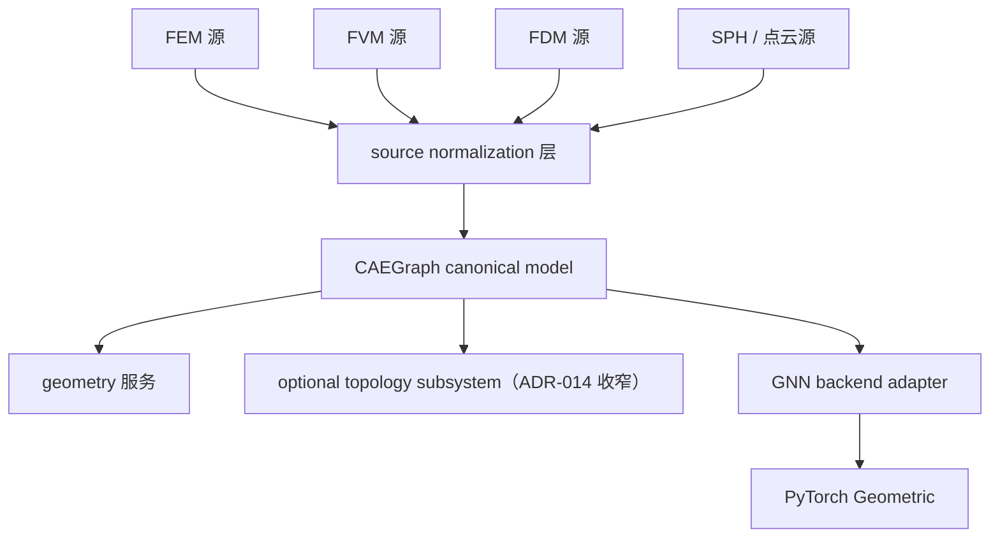

# ADR-015: CAEGraph canonical representation（异构 CAE 源与 GNN 之间的规范化表示）

- 编号：ADR-015
- 标题：定义 CAEGraph canonical representation 作为异构 CAE 数据源与 GNN 模型之间的规范化表示；Mesh 降位为拓扑丰富的 source representation/view（FEM/FVM 场景专用）；PyG 为下游 backend adapter 而非领域抽象；若采纳，取代 ADR-007 D1/D3 与 ADR-009 的 Mesh→Graph 契约，收窄 ADR-014 为 topology subsystem，改写 ADR-012 的目标对象
- 日期：2026-09-07
- 状态：**proposed（草稿待 Architecture review，未生效；本版为 v2 修订——问题边界由「graph-first vs mesh-first」重定义为「异构 CAE 源与 GNN 之间的 canonical representation 是什么」）**
- 关联：ADR-007（D2 保留强化；D1/D3 拟取代）、ADR-008（图后端冻结条款之澄清性 ADR 即本 ADR）、ADR-009（Mesh→Graph 契约拟取代）、ADR-012（目标对象拟改写）、ADR-013（不变：meshio=external IO engine）、ADR-014（拟收窄为 topology subsystem，生效前不改）、ADR-011（future-evolution 机制先例）、Phase 2、ROADMAP、Design UML `class_diagram.puml`

## 背景（Context）

v1 草案把问题框成「根对象是 Mesh 还是 Graph」，过于狭窄。真实问题是：**异构 CAE 数据源与 GNN 模型之间的 canonical representation 是什么？**

项目工作流原则应为：

```
CAE data → CAEGraph → GNN
```

而非：

```
CAE data → Mesh → Graph → GNN
```

不同离散方法不共享统一的 Mesh 模型：

| 方法 | 物理实体 | 自然图构造 | Mesh 是否必需 |
| --- | --- | --- | --- |
| FEM | nodes / elements / facets | node graph（节点=mesh nodes，边=单元连接）或 cell graph（节点=elements，边=共享 facets）——**图构造需要策略选择** | 是 |
| FVM | control volumes / faces / flux connections | cell centers=节点，shared faces=边（与 FEM node graph 本质不同） | 是 |
| FDM | grid points / stencil | stencil 邻居=边（通常无单元拓扑） | 否 |
| SPH / 粒子 | particles | neighbor search=边（无 mesh） | 否 |

结论：**Mesh 无法作为普适根抽象**；不同数值方法需要不同的「CAE source → graph 构造策略」。

## 关键澄清（CAEGraph 不是什么）

- **不是** `torch_geometric.data.Data`——PyG 是下游实现 adapter；
- **不是** lossy 邻接图（仅 node-edge 关系）——那是被否决的方案 A；
- **是领域级图表示**，由以下部分组成：
  - entity representation（canonical entities + 稳定 global IDs）；
  - optional topology semantics（cell/facet 注解——由 ADR-014 收窄后的 topology subsystem 提供）；
  - fields（关联到实体）；
  - geometry；
  - regions（boundary/interface 语义分组）。

领域模型不依赖 PyG。

## 架构模型（概念图）



## 决策（Decision，若采纳）

1. **主领域对象 = CAEGraph（entity-centric canonical representation）**：canonical entities（稳定 global IDs）、fields（实体关联）、geometry、regions、**optional topology annotations**（cell/facet 语义来自 topology subsystem）。
2. **Mesh 的角色**：topology-rich source representation/view，服务 FEM/FVM 等 cell-based 方法；FDM/SPH/点云不需要它；**不是 universal domain truth**。
3. **图构造策略**：`CAE source → graph construction strategy → CAEGraph`（如 FEMGraphBuilder / FVMGraphBuilder / FDMGraphBuilder / SPHGraphBuilder）——**取代**单一 `Mesh → GraphBuilder` 契约（ADR-009 相应条款）。
4. **依赖方向冻结**：core（CAEGraph + topology subsystem，**永不 import PyG**）← geometry ← graph 层（PyG adapter：`CAEGraph → torch_geometric.data.Data`）；PyG 是 backend adapter，不是领域抽象。
5. **最终架构陈述（原句入 ADR）**：

> CAEGraph does not model meshes and then convert them into graphs. It normalizes heterogeneous CAE data sources into a canonical graph representation for physics AI. Meshes are one possible source representation used to construct graph topology, while PyG is one possible backend for graph learning.

## 与冻结条款的关系

- **ADR-007 D2 保留且强化**：core 永不 import PyG——CAEGraph 置于 core，PyG 停留在 graph 层 adapter。
- **ADR-008「禁替代图后端」的正名**：CAEGraph 是领域真源表示，不是图计算 backend；PyG 仍是唯一图学习 backend。本 ADR 即该冻结条款预设的 "new ADR"，属澄清而非违反。
- **ADR-007 D1/D3、ADR-009 Mesh→Graph 契约**：由本 ADR 取代（D1 的 Graph 层重释为 PyG adapter 层；D3 的 domain truth 由 Mesh 移交 CAEGraph）。

## 备选方案（Options considered）

| 方案 | 结论 | 原因 |
| --- | --- | --- |
| A. Graph = adjacency only（邻接图即真源） | 否决 | 丢失 cell/facet/field/region 语义；FEM/FVM 的 flux/Jacobian、facet↔cell 校验、BC 映射、VTK 拓扑一致性全部失锚（信息保真反证） |
| B. Mesh = universal truth（ADR-007/014 现状） | 否决/限制 | 对 FDM/SPH/点云强制伪造单元拓扑；图构造被锁死为 Mesh→Graph 单一路径；Mesh 被迫承担通用网格框架的越界角色 |
| C. CAEGraph entity-centric + topology subsystem（本提案） | 推荐 | 异构源统一规范化；cell-based 语义经 optional topology 子系统**完整保留**（ADR-014 收窄复用，不丢弃）；PyG 保持纯 adapter；与 ADR-008 定位（CAE→GNN 工作流）严格对齐 |

## 待冻结问题（评审定稿）

1. canonical entities 的精确集合与 ID 空间（node/edge 语义；ADR-014 的 IDs 契约如何平移）；
2. CAEGraph 是否内含 edge 实体（构造策略产物）还是邻接作为派生视图；
3. fields / geometry / regions 在 CAEGraph 上的挂载契约；
4. topology subsystem 的接口边界（cell-based 源必需、cell-free 源缺省）；
5. 图构造策略的注册与扩展契约（复用 core Registry？）。

## 采纳后的文档处置（本 ADR 生效前一律不动）

- **ADR-014**：标题与范围收窄为「Canonical topology representation」——内容保留（stable IDs / CellType / connectivity normalization / facet 语义 / topology validation），移入 CAEGraph topology layer；不再定义整个顶层对象。
- **ADR-012**：目标对象由 canonical Mesh 改为 CAEGraph；mesh loading 成为其中一条实现路径。
- **ADR-013**：不变——meshio 是 external source IO engine，其对象生命周期止于 IO adapter。
- **Design UML**：概念模型更新为 CAEGraph 中心 + optional topology subsystem + PyG adapter。
- **phase2-cae-data.md**：模块树按构造策略 / adapter 重构。

## 影响（Consequences）

- **生效前**：仅架构工作；禁止实现 `core/mesh.py`、mesh-centric io pipeline、任何 `Mesh → GraphBuilder` 假设；**CellType 保留**（topology subsystem 成员，已入 main，任何结局不受影响）。
- **生效后**：按上节处置清单改写相关 ADR 与文档，再重启 Coding 派单（首派单=topology subsystem 收窄落地或 CAEGraph 骨架，由评审决定）。
- 本 ADR 不引入新第三方依赖；不改变 utils←core←{geometry,io}←graph 分层方向（graph 层职责重释为 PyG adapter + 构造策略）。

## Revision history

- 2026-09-07 v1：以「graph-first vs mesh-first」为框（含 A/B/C 三案）。
- 2026-09-07 v2（本版）：问题边界重定义为「异构 CAE 源与 GNN 之间的 canonical representation」；A/B/C 重塑为 adjacency-only（否决）/ Mesh-universal（否决限制）/ CAEGraph entity-centric + topology subsystem（推荐）；补 FEM/FVM/FDM/SPH 范式表、Mermaid 概念模型、冻结条款正名与采纳后处置清单。
