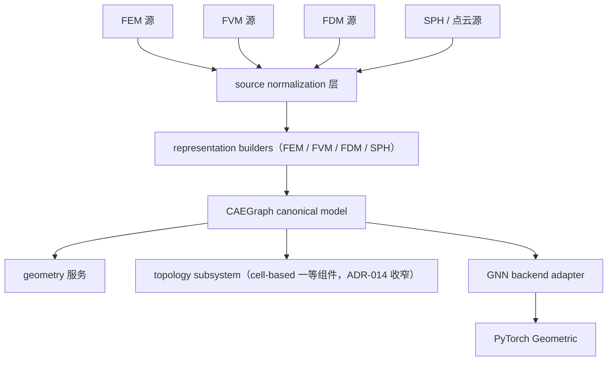
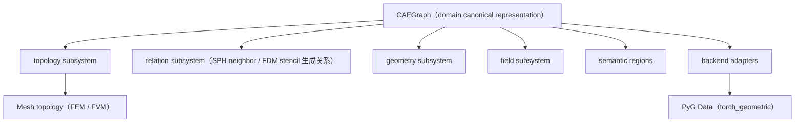

# ADR-015: CAEGraph graph-native canonical domain representation

- 编号：ADR-015
- 标题：冻结 CAEGraph 为 CAE 数据的 graph-native canonical domain representation——meshes / grids / particles 等离散化均为构造 CAEGraph entities 与 relations 的 source representation；Mesh 归位 topology subsystem（cell-based discretization representation，FEM/FVM）；PyG 为下游 backend adapter 而非领域抽象；本 ADR 取代 ADR-007 D1/D3 与 ADR-009 的 Mesh→Graph 契约，收窄 ADR-014，修订 ADR-012 目标对象
- 日期：2026-09-07
- 状态：**accepted（2026-09-07 经 Architecture review 采纳；v1→v3 演进见 Revision history）**
- 关联：ADR-007（D1/D3 已修订，D2 保留强化）、ADR-008（图后端冻结条款之澄清性 ADR 即本 ADR）、ADR-009（Mesh→Graph 契约已取代）、ADR-012（目标对象已修订）、ADR-013（不变：meshio=external IO engine）、ADR-014（已收窄为 topology subsystem）、ADR-011（future-evolution 机制先例）、Phase 2、ROADMAP、Design UML `class_diagram.puml`

## 背景（Context）

v1 草案把问题框成「根对象是 Mesh 还是 Graph」，过于狭窄。真实问题是：**异构 CAE 数据源与 GNN 模型之间的 canonical representation 是什么？**

项目工作流原则应为：

```
CAE data → CAEGraph → GNN
```

而非：

```
CAE data → Mesh → Graph → GNN
```

不同离散方法不共享统一的 Mesh 模型：

| 方法 | 物理实体 | 自然图构造 | Mesh 是否必需 |
| --- | --- | --- | --- |
| FEM | nodes / elements / facets | node graph（节点=mesh nodes，边=单元连接）或 cell graph（节点=elements，边=共享 facets）——**图构造需要策略选择** | 是 |
| FVM | control volumes / faces / flux connections | cell centers=节点，shared faces=边（与 FEM node graph 本质不同） | 是 |
| FDM | grid points / stencil | stencil 邻居=边（通常无单元拓扑） | 否 |
| SPH / 粒子 | particles | neighbor search=边（无 mesh） | 否 |

结论：**Mesh 无法作为普适根抽象**；不同数值方法需要不同的「CAE source → graph 构造策略」。

## 关键澄清（CAEGraph 是什么 / 不是什么）

- **不是** `torch_geometric.data.Data` / `networkx.Graph` / `igraph.Graph` / 简单邻接矩阵——它们是 backend 或分析引擎，不是领域模型；
- **不是** lossy 邻接图（仅 node-edge 关系）——那是被否决的方案 A；
- **是面向物理仿真的 graph-native domain model（entity-centric canonical representation）**：核心不是图算法，而是稳定实体身份、物理语义、数据关联、多物理场字段、区域语义、与 GNN backend 的解耦。组成：
  - entities 与稳定 IDs；
  - relations / connectivity；
  - geometry；
  - fields（关联到实体）；
  - semantic regions（boundary/interface 语义分组）；
  - optional discretization metadata（domain-specific structures）。
- **领域语义所有权（为什么不继承通用图库）**：通用图库只知道 node/edge/attribute；CAE 需要知道 node（坐标/物理场/边界归属）、edge（连接性/几何关系/interface 关系）、region（inlet/wall/interface/periodic pair）、field（pressure/velocity/temperature）——这些领域语义属于 CAEGraph，不属于图计算库。因此方向永远是 `CAEGraph → adapter → PyG Data`，绝不反向。
- **topology subsystem 的地位**：对 cell-based 离散（FEM/FVM）是**一等组件（first-class component）**——node/element/facet/region/field 是物理语义而非可有可无的注解；对 mesh-free 方法（SPH/FDM），拓扑可缺省或由生成的邻接关系取代。facet 之所以保留，是因为它是 **domain relation**，不是 mesh artifact。

领域模型不依赖 PyG。

## 架构模型（概念图）



## 决策（Decision）

> **CAEGraph is the canonical graph-native representation of CAE data. Meshes, grids, particles, and other discretizations are source representations used to construct CAEGraph entities and relations.**

1. **主领域对象 = CAEGraph（entity-centric canonical representation，面向 physics AI）**：canonical entities（稳定 global IDs）、relations/connectivity、fields（实体关联）、geometry、semantic regions、optional domain-specific structures；**topology subsystem 对 cell-based 离散是一等组件，对 mesh-free 方法可缺省或由生成的邻接关系取代**。
2. **Mesh 的角色**：topology-rich **discretization representation**（数学离散对象，非仅仅是 IO source representation）——FEM/FVM 所用，是 **CAEGraph topology subsystem 的一种实现（one realization）**；FDM/SPH/点云不需要它；**不是 universal domain truth，也不再是顶层 canonical 对象**。
3. **表示构造策略（RepresentationBuilder）**：`CAE source → representation builder → CAEGraph`——职责是 **source discretization → CAEGraph entities + relations**，而非 mesh→PyG graph 的旧思路；命名采用 FEMRepresentationBuilder / FVMRepresentationBuilder / FDMRepresentationBuilder / SPHRepresentationBuilder（DiscretizationAdapter 为备选名）——**取代**单一 `Mesh → GraphBuilder` 契约（ADR-009 相应条款）。
4. **依赖方向冻结 + PyG 命名出清**：core（CAEGraph + subsystems，**永不 import PyG**）← geometry ← graph 层（两部分：representation builders + **PyG adapter：`CAEGraph → torch_geometric.data.Data`**，落位 `graph/pyg.py`）；**graph 层不得再以 `Graph` 类指代 PyG 对象**——领域图对象是 core 的 CAEGraph，PyG Data 只是 adapter 输出。
5. **最终架构陈述（原句入 ADR）**：

> CAEGraph does not model meshes and then convert them into graphs. It normalizes heterogeneous CAE data sources into a canonical graph representation for physics AI. Meshes are one possible source representation used to construct graph topology, while PyG is one possible backend for graph learning.

## 表示层级（Representation hierarchy，冻结）



层级语义：CAEGraph 是唯一的 domain canonical representation；topology / relation / geometry / field / regions 是其子系统（cell-based 方法下 topology 一等，mesh-free 方法下由 relation 生成关系顶替）；backend adapters 之下才是 PyG Data。

## 与冻结条款的关系

- **ADR-007 D2 保留且强化**：core 永不 import PyG——CAEGraph 置于 core，PyG 停留在 graph 层 adapter。
- **ADR-008「禁替代图后端」的正名**：CAEGraph 是领域真源表示，不是图计算 backend；PyG 仍是唯一图学习 backend。本 ADR 即该冻结条款预设的 "new ADR"，属澄清而非违反。
- **ADR-007 D1/D3、ADR-009 Mesh→Graph 契约**：由本 ADR 取代（D1 的 Graph 层重释为 PyG adapter 层；D3 的 domain truth 由 Mesh 移交 CAEGraph）。

## 性能边界

CAEGraph is optimized for domain representation and data interoperability, not for replacing general graph algorithm libraries. Benchmark expectations (memory usage, graph construction, neighbor query, CAEGraph→PyG conversion) are tracked in the roadmap.

## 备选方案（Options considered）

| 方案 | 结论 | 原因 |
| --- | --- | --- |
| A. Graph = adjacency only（邻接图即真源） | 否决 | 丢失 cell/facet/field/region 语义；FEM/FVM 的 flux/Jacobian、facet↔cell 校验、BC 映射、VTK 拓扑一致性全部失锚（信息保真反证） |
| B. Mesh = universal truth（ADR-007/014 现状） | 否决/限制 | 对 FDM/SPH/点云强制伪造单元拓扑；图构造被锁死为 Mesh→Graph 单一路径；Mesh 被迫承担通用网格框架的越界角色 |
| C. CAEGraph entity-centric + topology subsystem（本提案） | 推荐 | 异构源统一规范化；cell-based 语义经 **topology subsystem（一等组件）完整保留**（ADR-014 收窄复用，不丢弃）；PyG 保持纯 adapter；与 ADR-008 定位（CAE→GNN 工作流）严格对齐 |

## 待冻结问题（评审定稿）

1. canonical entities 的精确集合与 ID 空间（node/edge 语义；ADR-014 的 IDs 契约如何平移）；
2. CAEGraph 是否内含 edge 实体（构造策略产物）还是邻接作为派生视图；
3. fields / geometry / regions 在 CAEGraph 上的挂载契约；
4. topology subsystem 的接口边界（cell-based 一等组件；mesh-free 缺省或由邻接生成顶替）；
5. RepresentationBuilder 的层位与注册契约（graph/builder.py vs io 层；复用 core Registry？）。

## 采纳后的文档处置（随本 ADR 采纳执行）

- **ADR-014**：标题与范围收窄——**ADR-014 defines the canonical topology model used by cell-based discretizations. It does not define the complete CAEGraph representation.** 内容保留（stable IDs / CellType / connectivity normalization / facet 语义 / topology validation），归位 topology subsystem；已落地的 `core/celltype.py` 随采纳迁移至 `core/topology/celltype.py`。
- **ADR-012**：目标对象由 canonical Mesh 改为 CAEGraph；mesh loading 成为其中一条实现路径。
- **ADR-013**：不变——meshio 是 external source IO engine，其对象生命周期止于 IO adapter。
- **Design UML**：概念模型更新为 CAEGraph 中心 + subsystems（topology 一等）+ representation builders + PyG adapter。
- **phase2-cae-data.md**：模块树按 CAEGraph core + topology subsystem + representation builders / PyG adapter 重构（本 ADR v3 已先行同步方向版）。

## 影响（Consequences）

- **Coding 重启**：禁止项解除，按 phase2 Coding gate 顺序执行（CAEGraph core 先行）；**CellType 已落地并归位 topology subsystem**（`core/celltype.py` → `core/topology/celltype.py` 迁移随首个 topology 派单执行）。
- **文档处置**：相关 ADR 修订注记与本 ADR 同变更集落盘；ARCHITECTURE.md / ROADMAP / docs overview / README 的规范级联随后续变更集同步。
- 本 ADR 不引入新第三方依赖；不改变 utils←core←{geometry,io}←graph 分层方向（graph 层职责重释为 PyG adapter + 构造策略）。

## Revision history

- 2026-09-07 v1：以「graph-first vs mesh-first」为框（含 A/B/C 三案）。
- 2026-09-07 v2：问题边界重定义为「异构 CAE 源与 GNN 之间的 canonical representation」；A/B/C 重塑为 adjacency-only（否决）/ Mesh-universal（否决限制）/ CAEGraph entity-centric + topology subsystem（推荐）；补 FEM/FVM/FDM/SPH 范式表、Mermaid 概念模型、冻结条款正名与采纳后处置清单。
- 2026-09-07 v3（本版）：CAEGraph 定为 graph-native canonical domain representation；Mesh 归位 topology subsystem（cell-based 一等组件）；加载经 RepresentationBuilder 构造 CAEGraph；PyG 仅为 backend adapter。
