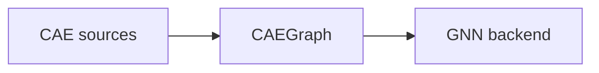

# ADR-015: CAEGraph graph-native canonical domain representation

- 编号：ADR-015
- 标题：冻结 CAEGraph 为 CAE 数据的 canonical domain representation——meshes / grids / particles 等离散化均为 source representation；构造契约见 ADR-016，backend 适配契约见 ADR-017；本 ADR 取代 ADR-007 D1/D3 与 ADR-009 的 Mesh→Graph 契约，收窄 ADR-014，修订 ADR-012 目标对象
- 日期：2026-09-07
- 状态：**accepted（2026-09-07 经 Architecture review 采纳；v1→v5 演进见 Revision history）**
- 关联：ADR-007（D1/D3 已修订，D2 保留强化）、ADR-008（图后端冻结条款之澄清性 ADR 即本 ADR）、ADR-009（Mesh→Graph 契约已取代）、ADR-012（目标对象已修订）、ADR-013（不变：meshio=external IO engine）、ADR-014（cell-based topology 规范）、**ADR-016（construction contract，proposed）**、**ADR-017（backend adaptation contract，proposed）**、Phase 2、ROADMAP、Design UML `class_diagram.puml`

## 背景（Context）

v1 草案把问题框成「根对象是 Mesh 还是 Graph」，过于狭窄。真实问题是：**异构 CAE 数据源与 GNN 模型之间的 canonical representation 是什么？**

项目工作流原则应为：

```
CAE data → CAEGraph → GNN
```

而非：

```
CAE data → Mesh → Graph → GNN
```

不同离散方法不共享统一的 Mesh 模型：

| 方法 | 物理实体 | 自然图构造 | Mesh 是否必需 |
| --- | --- | --- | --- |
| FEM | nodes / elements / facets | node graph（节点=mesh nodes，边=单元连接）或 cell graph（节点=elements，边=共享 facets）——**图构造需要策略选择** | 是 |
| FVM | control volumes / faces / flux connections | cell centers=节点，shared faces=边（与 FEM node graph 本质不同） | 是 |
| FDM | grid points / stencil | stencil 邻居=边（通常无单元拓扑） | 否 |
| SPH / 粒子 | particles | neighbor search=边（无 mesh） | 否 |

结论：**Mesh 无法作为普适根抽象**；不同数值方法需要不同的「CAE source → graph 构造策略」。

## 决策（Decision）

> **CAEGraph is the canonical graph-native representation of CAE data. Meshes, grids, particles, and other discretizations are source representations used to construct CAEGraph.**



1. **CAEGraph 是 canonical domain representation**：面向 physics AI 的 entity-centric 领域模型，组成包含 entities、relations、geometry、fields、regions、conditions（cell-based 方法下含 topology semantics）——具体字段设计随 CAEGraph core 派单定稿，本 ADR 不展开。CAEGraph 不是 lossy adjacency graph：仅 nodes + edges 会丢失 fields / geometry / regions / conditions / topology semantics。
2. **Mesh 是一种 source/topology representation**：cell-based 离散（FEM/FVM）的结构化输入；不是 universal truth，不覆盖所有 CAE 方法（FDM 不需要 cell topology，SPH 无传统 mesh），也不再是顶层 canonical 对象。cell-based 的 topology 规范由 ADR-014 承载（topology subsystem：cell-based 方法下一等，mesh-free 方法下不存在）。
3. **Different CAE sources are normalized into CAEGraph through source-specific construction mechanisms, whose contracts are defined in ADR-016.**（CAEGraph 独立于任何 source representation；「如何进入」不在本 ADR 冻结。）
4. **backend framework 不属于 CAEGraph**：PyG 是 backend implementation，不是 domain representation；「CAEGraph 如何被 ML 框架消费」的适配契约由 ADR-017 定义。

最终架构陈述（原句入 ADR）：

> CAEGraph does not model meshes and then convert them into graphs. It normalizes heterogeneous CAE data sources into a canonical graph representation for physics AI. Meshes are one possible source representation used to construct graph topology, while PyG is one possible backend for graph learning.

## 边界（Scope）

本 ADR 只冻结上述范式；以下问题由各自的 ADR 承载，本 ADR 不重复立法：

- 构造契约（source-specific construction、builder 策略）——**ADR-016**；
- backend 适配契约（adapter / DataGraph 概念 / PyG mapping）——**ADR-017**；
- cell-based topology 规范（CellType / connectivity / facet）——**ADR-014**。

同时明确禁止：**CAEGraph 的 source-type 子类体系**（MeshGraph / GridGraph / ParticleGraph 之类）——不同数值方法是不同的构造方式，不是不同的领域对象。

## 与冻结条款的关系

- **ADR-007 D2 保留且强化**：core 永不 import PyG——CAEGraph 置于 core，PyG 停留在 backend 侧（分层立法属 ADR-007，适配细节属 ADR-017）。
- **ADR-008「禁替代图后端」的正名**：CAEGraph 是领域真源表示，不是图计算 backend；PyG 仍是唯一图学习 backend。本 ADR 属澄清而非违反。
- **ADR-007 D1/D3、ADR-009 Mesh→Graph 契约**：由本 ADR 取代。

## 备选方案（Options considered）

| 方案 | 结论 | 原因 |
| --- | --- | --- |
| A. Graph = adjacency only（邻接图即真源） | 否决 | 丢失 cell/facet/field/region 语义；FEM/FVM 的 flux/Jacobian、facet↔cell 校验、BC 映射、VTK 拓扑一致性全部失锚（信息保真反证） |
| B. Mesh = universal truth（ADR-007/014 原状） | 否决/限制 | 对 FDM/SPH/点云强制伪造单元拓扑；构造被锁死为 Mesh→Graph 单一路径；Mesh 被迫承担通用网格框架的越界角色 |
| C. CAEGraph entity-centric canonical representation（本决策） | 采纳 | 异构源统一规范化；cell-based 语义经 ADR-014 完整保留；PyG 保持 backend 定位；与 ADR-008 定位（CAE→GNN 工作流）严格对齐 |

## 后续设计决策（Future design decisions）

本 ADR 已 accepted；实现层设计问题按归属分发：

1. canonical entities 的精确集合与 ID 空间——随 CAEGraph core 派单定稿；
2. CAEGraph 是否内含 edge 实体还是邻接作为派生视图——随 CAEGraph core 派单定稿；
3. fields / geometry / regions 在 CAEGraph 上的挂载契约——随 CAEGraph core 派单定稿；
4. 构造机制契约（builder 抽象、API、注册、落位）——**ADR-016**（proposed）；
5. backend 适配契约（DataGraph 概念、PyG mapping、batching）——**ADR-017**（proposed）。

## 影响（Consequences）

- **Coding 重启**：按 phase2 Coding gate 顺序执行（CAEGraph core 先行）；CellType 已落地并归位 topology subsystem（迁移随首个 topology 派单执行）。
- 本 ADR 不引入新第三方依赖；不改变依赖分层方向（分层立法属 ADR-007）。
- 架构解释图（representation hierarchy 等）由 ARCHITECTURE.md 与 docs overview 承载，不入本 ADR。

## Revision history

- 2026-09-07 v1：以「graph-first vs mesh-first」为框（含 A/B/C 三案）。
- 2026-09-07 v2：问题边界重定义为「异构 CAE 源与 GNN 之间的 canonical representation」；A/B/C 重塑；补 FEM/FVM/FDM/SPH 范式表与备选方案。
- 2026-09-07 v3：CAEGraph 定为 graph-native canonical domain representation；Mesh 归位 topology subsystem（cell-based 一等组件）；PyG 仅为 backend adapter。
- 2026-09-07 v4：accepted 后架构澄清——DataGraph 边界、builder/adapter 契约移出冻结范围（scope exclusions）、禁止 source-type 子类。
- 2026-09-08 v5：Accepted architecture refined: implementation-level construction and backend adaptation decisions were separated into ADR-016 and ADR-017. ADR-015 scope reduced to the canonical representation decision (four decisions); the dependency-direction legislation returned to ADR-007/017; detailed architecture diagrams migrated to ARCHITECTURE.md / docs.
