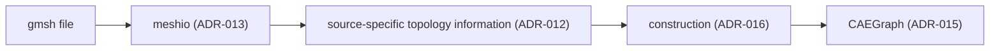

# ADR-016: CAEGraph construction contract

- 编号：ADR-016
- 标题：冻结「外部 CAE source 如何进入 CAEGraph」的构造边界——CAE source representation 经 source-specific construction 进入 CAEGraph；construction 是策略不是领域对象类型；不冻结 builder API、类名、registry 与 module layout
- 日期：2026-09-08
- 状态：**accepted（2026-09-08 经 Architecture review 采纳，构造边界冻结）**
- 关联：ADR-015（父决策：canonical representation）、ADR-012（io 层 source normalization 管线——本 ADR 的上游）、ADR-013（external IO engine）、ADR-014（cell-based topology 规范）、ADR-009（其 GraphBuilder 条款由本 ADR 承接细化）、Phase 2、Design UML `class_diagram.puml`

## 背景（Context）

外部 CAE 数据形态各异——FEM/FVM mesh、FDM grid、SPH particles、experimental data——不存在统一输入结构。ADR-015 已冻结 CAEGraph 为 canonical representation；本 ADR 回答：**外部 CAE 数据如何进入 CAEGraph？**

与 IO 层的职责分界：

文件解析与 IO normalization 属 ADR-012/013（其对象生命周期止于 io adapter）；本 ADR 只管辖 **source representation → CAEGraph** 的构造边界。

## 决策（Decision）

1. **构造边界（construction boundary）**：`CAE source representation → source-specific construction → CAEGraph`。Representation construction is separated from IO and from domain/topology ownership, while consuming topology semantics defined by ADR-014. Topology objects do not provide `to_graph()` because representation construction is not their responsibility; the dependency direction remains governed by ADR-007.
2. **construction 是策略，不是领域对象类型**：FEM ≠ FEMGraph、SPH ≠ SPHGraph——不同数值方法是不同的构造方式（策略变化点），不是不同的 CAEGraph 子类型（ADR-015 禁令在本层的落实）。
3. **与 ADR-012 的交接**：mesh-based sources are parsed and normalized by ADR-012/013 into source-specific topology information（cell topology 语义 per ADR-014），then constructed into CAEGraph；无 cell topology 的 source（grid / particles）不经 cell 拓扑，直接构造 + 邻接生成。

## 不冻结的内容

- Builder API（签名、方法集）；
- builder 类名与类层次；
- 注册机制（是否复用 core Registry）；
- module layout（`graph/builder.py` 等落位）。

以上随 coding 派单定稿；届时偏离本 ADR 冻结的边界才需修订本 ADR。

## 备选方案（Options considered）

| 方案 | 结论 | 原因 |
| --- | --- | --- |
| Mesh→Graph 单一转换路径（GraphBuilder，ADR-009 原案） | 否决 | 锁死构造路径；FDM/SPH 强制伪 mesh（ADR-015 方案 B 论证） |
| source-type 子类体系（FEMGraph / SPHGraph） | 否决 | 分类学复辟；继承不承载构造差异（ADR-015 禁令） |
| IO 层拥有 CAEGraph 构造逻辑（IO owns construction logic） | 否决 | 构造逻辑所有权不得归 IO——loader 可内部委托 builder，但 ownership 留在构造侧（ADR-012 边界不破坏） |
| source-specific construction 策略层（本决策） | 采纳 | 边界统一、策略开放；API 留待 coding 派单 |

## 影响（Consequences）

- Phase 2 构造派单（CAEGraph core 之后）按本边界设计；具名 builder 与 API 在派单中定稿并附回归测试。
- 正面：新增 source 族（新格式、新离散方法）不需要新 ADR，除非改变本 ADR 冻结的边界。
- 不改变依赖分层与 PyG 边界（ADR-007/015）。

## Revision history

- 2026-09-08 v1：自 ADR-015 v4/v5 拆分而出——冻结构造边界；API/类名/registry/module layout 不冻结，随 coding 派单定稿。
- 2026-09-08：accepted（Architecture review 通过，构造边界冻结）。
