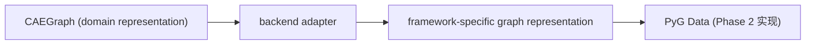

# ADR-017: CAEGraph backend adaptation contract

- 编号：ADR-017
- 标题：冻结「CAEGraph 如何被 ML 框架消费」的适配边界——CAEGraph → backend adapter → framework-specific graph representation；DataGraph 是概念性的 backend representation layer，非必须实现类、非领域对象
- 日期：2026-09-08
- 状态：**proposed（待 Architecture review）**
- 关联：ADR-015（父决策：canonical representation）、ADR-007（D2：core 永不 import PyG；PyG 自 graph 层起可用）、ADR-008（无替代图后端）、ADR-009（学习层原生继承）、ADR-016（上游构造契约）、Phase 2、Design UML `class_diagram.puml`

## 背景（Context）

CAEGraph 回答「**什么物理问题**」；GNN 框架需要的是 tensor、batch、edge_index、feature matrix——回答「**如何计算**」。两个问题分属领域层与 backend 层，因此需要适配边界。本 ADR 回答：**如何让 CAEGraph 被机器学习框架使用？**

## 决策（Decision）

1. **适配链冻结**：`CAEGraph → backend adapter → framework-specific graph representation`，PyG Data 为 Phase 2 实现。
2. **DataGraph 是概念名（backend representation layer）**：指 adapter 产出的框架侧数据表示整体，**不是必须实现的类**，更不是领域对象——不拥有 boundary semantics、CellType、physical regions、mesh topology truth；领域语义止于 CAEGraph（ADR-015）。
3. **依赖方向**：core 永不 import PyG（ADR-007 D2）；adapter 属 graph 层；DataGraph / PyG Data 只是 backend 侧对象。
4. **换 backend 的门槛**：替换或新增 backend adapter 本身不需要新 ADR；仅当改变 domain/backend 边界或依赖方向时，需 architecture review（必要时新 ADR）。

## 不冻结的内容

- DataGraph 字段与 tensor schema；
- CAEGraph → PyG 的字段 mapping；
- batching 策略；
- 性能优化。

以上随 adapter 派单定稿。

## 备选方案（Options considered）

| 方案 | 结论 | 原因 |
| --- | --- | --- |
| 领域类 `Graph(torch_geometric.data.Data)`（ADR-009 历史案） | 否决 | 领域语义渗入 backend 对象；PyG 耦合 domain（ADR-015 取代） |
| CAEGraph 直接产出 PyG Data（无 adapter 层） | 否决 | 领域层被迫知道 backend 细节；换框架即改 core |
| DataGraph 固化为中间基类 | 否决 | 制造类 PyG 二次抽象；违反「概念非类」定位 |
| backend adapter + 概念性 DataGraph layer（本决策） | 采纳 | 领域/backend 解耦；实现自由度留给 coding |

## 影响（Consequences）

- Phase 2 adapter 派单（`graph/pyg.py` 方向）按本边界设计；字段 mapping 与 schema 在派单中定稿并测试。
- transforms / dataset 消费的是 framework representation（PyG Data），不是 CAEGraph——层间数据面以此为准。
- 不改变 ADR-008 冻结（PyG 仍是当前唯一图学习 backend）。

## Revision history

- 2026-09-08 v1：自 ADR-015 v4/v5 拆分而出——冻结适配边界；DataGraph 保持概念定位，schema / mapping / batching 不冻结，随 adapter 派单定稿。
