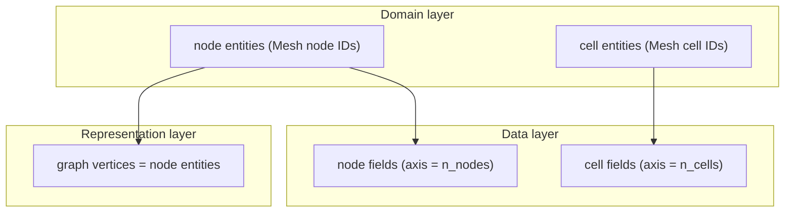

# ADR-019: Phase 2 CAEGraph 实体族/关系最小模型与 cell-based 构造语义

- 编号：ADR-019
- 标题：冻结 Phase 2 的 CAEGraph 实体族（node/cell entities）与关系最小数据模型（node graph）、cell-based 构造语义（face 展开去重、region 驱动 NodeCategory 的适用边界）与构造期 field 基数校验；region 分类机制与多图构造、几何特征挂载、序列化为本 ADR 不覆盖项
- 日期：2026-09-21（v4）
- 状态：accepted（v3 裁决采纳维持有效；v4 为结构重构，语义零变化——见修订历史）
- 关联：ADR-015（canonical 表示）、ADR-016（构造契约——本 ADR 为其"随派单定稿"的构造语义提供数据模型依据）、ADR-017（后端适配，下游）、ADR-018（领域组成——本 ADR 即其不覆盖的 entity identity 与 relation 存储的 dedicated ADR）、ADR-014（cell-based 拓扑规范）、Phase 2、Design UML `class_diagram.puml`、不变式登记 `ADR-019-invariants.yaml`

## 背景（Context）

ADR-018 将实体身份（ID schema）与 relation 存储形式（含 edge container）显式移交后续 dedicated ADR；而 gate 4 的 representation builder 必须落地实体+关系存储——构造无法绕过数据模型决策。本 ADR 即该 dedicated ADR：只冻结 Phase 2 cell-based 构造所需的最小模型，范围之外的问题集中列入"本 ADR 不覆盖项"。

## Mental Model

理解本 ADR 需要先分清三个层次与两类身份：

**Entity ≠ Graph vertex**：

- **Entity** 拥有领域身份，可被 field 或其他 domain data 引用；
- **Graph vertex** 是当前 graph representation 中参与 message passing 的对象。

Phase 2 的映射：

- node entities → graph vertices；
- cell entities → domain entities（identity 来自 Mesh cell index，**无独立存储**）。

graph vertex 是 **representation choice**，不是 entity 的定义。未来的 representation 可能采用不同的 entity family 组合（如 cell-center 图以 cell entities 为 vertices——已列入不覆盖项），但必须通过新的架构决策定义。

## Terminology

- **Entity**：领域身份（domain identity），可被 field 或其他 domain data 引用。不是 GNN node，也不是 Python object。
- **Entity family**：语义身份空间（node entities / cell entities）。不是 Python class hierarchy——Phase 2 不引入 NodeEntity / CellEntity 类。
- **Positional ID**：canonical Mesh 存储索引。例：node entity 3 == Mesh node index 3；cell entity 5 == Mesh cell index 5。语义范围：单 CAEGraph instance。
- **Graph vertex**：当前 graph representation 中参与 message passing 的对象。Phase 2 = node entities；未来表示可能不同（cell-center 图已列入不覆盖项）。Entity family 回答"领域里有什么身份"，Graph vertex 回答"当前图上什么在参与 message passing"——二者不可互相替代。
- **Representation choice**：表示层选择。改变 representation 不等于改变 domain entity model。
- **Deferred decision（本 ADR 不覆盖项）**：本 ADR 明确不冻结、未来需要专门架构决策的问题。禁止理解为"提前实现接口等待未来确认"。

## 决策（Decision）

### D1 Entity family model

**一句话结论**：Phase 2 cell-based CAEGraph 由两个 entity family 构成——node entities 与 cell entities，均使用单实例内的 canonical Mesh positional ID；node entities 充当 Phase 2 node graph 的 vertices。

**展开解释**：node entity ID = Mesh node index；cell entity ID = Mesh cell index；身份语义范围为单 CAEGraph instance。entity family ≠ Python class：Mesh 已提供 canonical identity space，Phase 2 不引入 NodeEntity / CellEntity 等用于复制 Mesh identity 的领域对象。**cell 是 entity 但没有 cell_entities 存储**，因为 entity identity does not require duplicated storage——cell identity 由 Mesh cell index 承载，cell 字段经构造期基数校验（D5）与 cell ID 关联。`n_entities` == node graph vertex count == `n_nodes`，**不是** `n_nodes + n_cells`。本条构成 ADR-018 entity-identity 不覆盖项的 Phase 2 最小关闭语义范围：仅关闭"单实例内 positional 双 family"这一最小集合。

**实现约束**：不创建实体包装类；不创建 cell_entities 存储成员；`n_entities` 语义如上（详见 D5 的构造语义）。

**正误示例**：

- 正确：`graph.n_entities == mesh.n_nodes`；cell 字段按首轴基数 == `n_cells` 校验后与 cell ID 关联。
- 错误：`class NodeEntity` / `class CellEntity`（Mesh identity 的复制）；`graph.n_entities = mesh.n_nodes + mesh.n_cells`；`graph.cell_entities` 数组。

### D2 Relation model

**一句话结论**：node graph 的关系 = 全部 canonical cells 的 codim-1 face 模板展开出的规范去重无向节点对集合。

**展开解释**——构造步骤规则：

1. 遍历 canonical cells；
2. 取每个 cell 的 codim-1 face templates；
3. 展开 face boundary node pairs（含环回）：2-node face → 1 对；k ≥ 3 face → k 对 cyclic pairs；
4. 规范化：`(min, max)`；
5. 丢弃同端点候选对 `(a, a)`（退化单元）；
6. 全局去重；
7. 按 `(min, max)` 字典序排序。

**1D 特例**：`topo_dim == 1` 时 cell（LINE2）本身即边，贡献其节点对（其 codim-1 faces 为维度 0 的点，不入 canonical topology，ADR-014）。

单 cell 唯一边参考表（**候选边 ≠ 去重后唯一边**）：

| Cell | 候选 | 唯一 |
| --- | --- | --- |
| LINE2 | 1 | 1 |
| TRI3 | 3 | 3 |
| QUAD4 | 4 | 4 |
| TET4 | 12 | 6 |
| PYR5 | 16 | 8 |
| WEDGE6 | 18 | 9 |
| HEX8 | 24 | 12 |

cell-center 图列入本 ADR 不覆盖项。

**实现约束**：存储前必须完成规范化与去重；同端点候选对不得进入结果。

**正误示例**：

- 正确：`(0, 1)` 规范对；HEX8 单 cell 展开去重后恰 12 条。
- 错误：`(3, 1)`（非规范序）、`(2, 2)`（自环）、重复边、未去重的 24 条候选直接入库。

### D3 Storage

**一句话结论**：CAEGraph 的图存储保存的是 node graph representation，不是完整 domain entity universe。

**展开解释**：关系以规范化去重的无序对集合语义存储；每 **node** 实体携带 NodeCategory 注解，Phase 2 中 cell 实体不参与 NodeCategory。存储的边端点必须为**整数**（bool 虽为 int 子类亦拒绝）。backend adapter 可以将无向关系集 materialize 为对称有向边 `(u, v)` / `(v, u)`——该转换属 backend adaptation（供 ADR-017 消费），**不属 CAEGraph storage**。

**实现约束**：容器实现形式（tuple 对列表 vs CSR）为实现细节，不冻结。

**正误示例**：

- 正确：存储 `((0, 1), (1, 2))`；adapter 侧展开为 `(0,1),(1,0),(1,2),(2,1)`。
- 错误：CAEGraph storage 中保存 `(u, v)` 与 `(v, u)` 双向边；float/str/bool 端点。

### D4 NodeCategory

**使用前提**：当前推导规则**仅适用于代表 boundary participation 的 region 类别**。internal interface 不直接套用（interface 节点会被误标 BOUNDARY）；physical group 不自动解释为 boundary。分类机制是架构决策，不由 region membership count 单独隐式定义。

**当前机械映射规则**（boundary-participation 范围内）：节点不属于任何 region → INTERIOR；恰属 1 个 **distinct region** → BOUNDARY；≥2 个 distinct regions → CORNER。计数按去重后的 region 归属，不按 facet 出现次数。

**显式限制**：① 1D 无 canonical facet，NodeCategory 恒为 INTERIOR（继承 ADR-014——POINT facets 为已记录的未来扩展）；② 同壁面两个 region 共享节点会被标注 CORNER（显式语义限制，非缺陷）。boundary-class 判定细节不在本 ADR 冻结；可用旁证：ADR-014 `facet_cells` 邻接数（`len == 1` 为 exterior 候选）。

**后续 dedicated ADR**：一般化 region 分类规则不在本 ADR 冻结。触发条件（满足其一即立项）：① Phase 3 BC 编码 / physics 损失层需要区分 interface 与 boundary 语义；② dataset 持久化或 GNN 输入编码需要按 region 角色正交查询。

### D5 Construction

**一句话结论**：构造 = `Mesh + BoundaryManager + optional Fields` → 满足 Phase 2 最小表示契约的 CAEGraph（引用该 Mesh 为 topology provider）。

**展开解释**：field 基数采用 **leading entity axis cardinality** —— `association == "node"` 的 field 首轴长度 == `n_nodes`，`association == "cell"` 的 field 首轴长度 == `n_cells`；不以 Python `len()` 作为领域契约（检查机制属实现细节）。region membership ID 必须落于所供 Mesh 的 facet namespace，越界即构造失败——**Region 不拥有 topology**，校验责任在 representation construction。BoundaryManager 构造后语义：NodeCategory 为构造期结果，manager 事后 mutation 不追溯修改已构造的 CAEGraph；本条仅冻结构造期结果的不可追溯性（存储冻结的直接推论），region 检索/绑定机制仍属 ADR-018 不覆盖项，引用 vs 整体快照不冻结。

**实现约束**：构造期执行 field 基数校验与 membership namespace 校验；`CAEGraph.associate_field()` 在 Phase 2 为 lightweight association API——不做 topology-cardinality 校验（见下节声明）。

**正误示例**：

- 正确：构造期拦截首轴长度错误的 node/cell 字段；拦截引用未知 facet 的 region。
- 错误：在 `associate_field()` 内执行 topology cardinality validation；以 `len(values)` 措辞作为领域契约写入对外文档。

## 本 ADR 不覆盖项（Deferred decisions）

- 多图构造并存（node graph + cell-center graph）；
- 几何特征挂载（geometry slice 兑现 Design UML 的 `MeshRepresentationBuilder ..> GeometryProcessor`）；
- 增量更新；
- 跨实例 ID（多命名空间 / 序列化 / 分布式——ADR-018 不覆盖项维持不覆盖）；
- serialization 与 batching；
- builder registry（单一 builder，第二 source 族出现再议）；
- 一般化 region 分类机制（见 D4 触发条件）；
- BoundaryManager 输入的引用 vs 快照语义；
- edge 容器形式与字段 schema 的进一步冻结（builder API/类名/落位依 ADR-016 不冻结）。

以上各项禁止提前实现接口等待未来确认；纳入决策范围须专门架构决策。

## associate_field 的 Phase 2 状态声明

`CAEGraph.associate_field()` 在 Phase 2 为 **lightweight association API**：不做 topology-cardinality 校验（基数校验仅在构造期执行）；其长期去留记入 backlog，不改 API。

## Invariant checklist

机器可审计登记见 `ADR-019-invariants.yaml`（17 条：D1×3、D2×4、D3×2、D4×3、D5×4、Consequences×1；含 `TEST_MISSING` 显式登记与 `explicitly_not_frozen` 集中清单）。人类可读摘要：实体族与 `n_entities` 语义（D1）；边的规范化/去重/排序、自环与退化对拒绝、各 cell 类型唯一边数、1D 特例（D2）；整数端点、无双向重复（D3）；类别三分映射、distinct-region 计数、1D 恒 INTERIOR（D4）；构造期 field 基数、membership 越界失败、不可追溯、associate_field 轻量性（D5）；对称边 materialization 属 backend adaptation（Consequences）。每条均可判定真假并与测试对应——缺测试的不变式以 `TEST_MISSING` 显式登记，不静默消失。

## 错误实现示例（本 ADR 必须阻止）

- `class Entity` / `class NodeEntity` / `class CellEntity`——Mesh identity 的复制；
- `n_entities = n_nodes + n_cells`；
- graph vertex ≡ entity（把表示层选择当作领域定义）；
- CAEGraph 存储 `cell_entities` 数组复制 Mesh identity；
- region 直接拥有 topology（Region 的 membership 必须经 representation construction 校验，不自行解析拓扑）；
- 重复边、非规范序 `(3, 1)`、自环 `(a, a)`；
- `associate_field()` 执行 topology cardinality validation；
- CAEGraph storage 中保存 `(u, v), (v, u)` 双向 PyG 边；
- 实现本 ADR 不覆盖项：cell-center graph、serialization、geometry attachment、builder registry。

## 备选方案（Options considered）

| 方案 | 结论 | 原因 |
| --- | --- | --- |
| 同时实现 node graph 与 cell-center 图 | 否决 | Phase 2 无消费者；推迟到有 FVM 证据时按 ADR-016 扩展策略 |
| 实体 ID 引入独立命名空间/UUID | 否决 | ADR-018 不覆盖项——影响 serialization/distributed/batching，证据未齐 |
| edge container 冻结为 CSR | 否决 | 过早优化；语义（规范化去重对集合）已足够，容器形式随性能证据定 |
| NodeCategory 由未声明边界 facet 推导（拓扑驱动） | 否决 | 边界语义唯一真源是 region（ADR-010/018）；拓扑面无语义身份，拓扑驱动推导会制造无语义的 BOUNDARY 噪声 |
| field 长度校验留在 CAEGraph.associate_field | 否决 | 校验需要 entity 计数（拓扑事实）；associate_field 不持有 topology 语义，ADR-014 组成修订已将其定位到表示构造层 |
| NodeCategory 推导改为 region-membership-count 注解并改名 | 记录在案 | 如实反映机械计数语义、消除 BOUNDARY/CORNER 误读；待分类机制裁决时一并评估 |
| NodeCategory 降级为 boolean node mask | 记录在案 | 消除类别语义负担；损失三值信息，待分类机制裁决时一并评估 |

## 影响（Consequences）

- gate 4 Coding（CAEGraph 实体/关系/NodeCategory 存储 + mesh representation builder）获得设计依据；builder API/命名/落位仍随 coding 派单定稿（ADR-016 不冻结项不变）。
- CAEGraph 增加构造期填充的最小图数据与只读访问器；ADR-018"语义组成不定义 class members"的原则不受影响——本 ADR 即授权该存储的专门冻结。
- Backend adapter（gate 4 后半）消费本模型的 edges / node_categories 产出 PyG Data schema。
- 不引入新依赖、不改变依赖分层与 PyG 边界（ADR-007 不变）。

## 修订历史（Revision history）

- 2026-09-17 v1：最小可行决策——D1–D6 冻结，不覆盖项显式记录。
- 2026-09-17 v2：补 1D 构造特例（LINE2 cell 贡献其节点对）——Slice 3a 复核发现 1D 空边集缺陷（3 节点梁构造出 0 条边）；accepted。
- 2026-09-18 v3：三方审查修订（作者两轮对抗性复核 + codex 独立审查两轮 + 人工裁决）。**v2 D1 被否决的理由**：以 mesh 节点直接定义实体，混淆 domain entity 与 GNN vertex，与 ADR-018 "Fields are associated with entities" 及 `association == "cell"` 的既有事实矛盾。**v2 D4 被限定的理由**：region-count 机械映射对 internal interface（interface 节点会被误标 BOUNDARY、两 interface 相交误标 CORNER）与 physical group 语义失效。v3 内容：D1 重写为双 entity family（node/cell，graph vertices 为 representation choice）；D2 errata（k-node face → k 候选对、退化对丢弃、唯一边参考表，数字经独立验证全部正确）；D4 限定 boundary-participation 范围并记录两个备选；D5 措辞与校验扩展（leading entity axis、membership 越界拦截、BoundaryManager 最小语义、"最小表示契约"表述）；新增 associate_field 状态声明与对称边 materialization 归属。D1/D4 决策级修订待报批重新采纳。
- 2026-09-18：v3 裁决采纳（arch/adr-019-reconciliation 派单）——D1 补 Phase 2 最小关闭口径与 cell entities 无独立存储声明（`n_entities` = node graph vertex 计数）；D4 补一般化分类的后续 ADR 立项触发条件；D5 补 BoundaryManager 语义与 ADR-018 不覆盖边界的关系；D3 补端点整数性；D2 状态链措辞自洽。状态恢复 accepted，D1–D5 全量生效。
- 2026-09-21 v4：结构重构为 agent 可执行约束格式——正文与演进历史分离（R0）；新增 Mental Model（三层 + Entity ≠ Graph vertex）与 Terminology（六条，含 Graph vertex）；D1–D5 改为"结论/展开/实现约束/正误示例"四段式；旧演进期措辞统一替换为规范术语（本 ADR 不覆盖项 / 冻结·定义 / 语义范围 / 纳入决策范围）；新增不变式登记（ADR 内人类可读摘要 + 独立 `ADR-019-invariants.yaml`，含 TEST_MISSING 与 explicitly_not_frozen）与错误实现示例。**语义零变化**；不变式清单自 v3 原文先行提炼作为零变化锚点（F3 流程）。两处显式化申报：① D4 "physical group 不自动解释"由"其他语义 region"拆出（语义等价）；② Mental Model 的 Data layer 为既有 field 语义的结构化表述。
