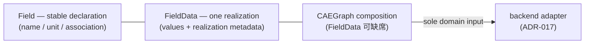

# ADR-020: Field declaration and field realization data separation

- 编号：ADR-020
- 标题：冻结 Field（stable physical quantity declaration）与 FieldData（单次 realization data）的语义边界——1:0..* 关系、Field 为 name/unit/association/component semantics 唯一真源、FieldData 可缺席且属 CAEGraph 组合、adapter 领域输入唯一、基数校验对象迁移至 FieldData values 且位置不变（representation construction）、多个可用 realization 禁止静默选择；不冻结 FieldData API/继承/identity 机制/ownership/container/存储组织/selection 机制
- 日期：2026-10-01
- 状态：**proposed（草案——待 Reviewer 独立审查与人工裁决；采纳后本 ADR 与对 ADR-007/014/017/018/019 的同步注记一并生效）**
- 关联：ADR-007（D6 Field 签名局部取代）、ADR-014（组成澄清——Mesh 不受影响）、ADR-015（canonical 表示——组成声明不变）、ADR-016（构造契约——校验位置不变）、ADR-017（适配主链不变；输入唯一性契约空隙封堵）、ADR-018（Fields / field data 词汇正式化）、ADR-019（D5 校验对象迁移；不变式登记同步）、Phase 2、Design UML `class_diagram.puml`（更新随 field-split implementation dispatch）

## 背景（Context）

1. Phase 2 早期已形成「CAEGraph 应当是描述物理问题的类，而不是数据类」的判断，但未落盘为 ADR；此后 Field 实现长成 `Field(name, values, unit, timestep, association)` 且 values 必填——现行报错文案 `"values are required: a field without data is a declaration, not a field"` 本身即声明/实现合一矛盾的显影，随本 ADR 退役（见「退役契约登记」）。
2. **法律定性**：现行实现**不违反 ADR-018**——ADR-018 冻结的是语义原则（「Fields 与 entities 关联」，而非直接与 geometry 或 topology 关联），其 scope exclusions 明确不冻结 class hierarchy / API / storage。真实定性是**抽象层级错位**：在 ADR-018 显式未裁决的空间里，实现选择了将 declaration 与 realization 合并为一个对象。
3. 领域动机：瞬态场景中 field semantics（pressure / Pa / cell 归属）恒定，values 随时刻产生数千个 realization，合并对象迫使语义随每个 realization 重复携带；且「已定义物理量但尚无解数据」的待求解问题无法表达——与 ADR-017 Context「CAEGraph 回答『什么物理问题』」存在张力。
4. 人工裁决采纳 **Option C**（拆分）；Option B（values 可选）否决——两种生命周期仍同居一个对象，1:* 无法表达。裁决前已完成事实链核验（对在册 ADR 原文逐字比对）与 Option C 七维对抗性压力测试（ADR-015/018 一致性、ADR-017 主链、ADR-019 D5、时序数据、多 realization、sparse coverage、过度设计风险），零事实冲突、零结构性反例。

## Mental Model

## Terminology

- **Field**：稳定物理量声明（stable physical quantity declaration）——name、unit、association、component semantics 的唯一载体；生命周期跨越该问题的全部 realization。
- **FieldData**：某 Field 的一次 realization data——values + realization metadata；成员为示例性方向，精确集合不冻结（D2）。
- **Declaration / realization**：声明回答「这个问题里有哪些物理量」；realization 回答「某次求解/观测/预测给了它什么数据」。
- **Realization metadata**：随单次 realization 变化的标注（timestep / time / coverage / sample identity 等）；与 Field 的稳定语义相对。
- **Silent selection（静默选择）**：消费方面对同一 Field 的多个可用 FieldData 时，未经显式指定而隐式取其一（如隐式取最新）。

## 决策（Decision）

**定位声明**：FieldData 是 Field 概念的 realization 成员——**不增加 ADR-007 D6「六抽象」计数，不自动成为 ADR-018 的第七领域概念**（Fields 仍为一个领域概念，由 Field 与 FieldData 共同承载）。

### D1 Field = stable declaration

**一句话结论**：Field 是 stable physical quantity declaration——name / unit / association / component semantics 的唯一真源；**不持 values、不持 timestep**。

**展开解释**：Field 回答「该问题中存在什么物理量、以什么单位、关联哪个 entity family」。瞬态多帧不产生新 Field；同一问题的全部 realization 共享同一组声明。

### D2 FieldData = one realization

**一句话结论**：FieldData 是某 Field 的一次 realization data——values + realization metadata（timestep / time / coverage / sample identity 等）。

**展开解释**：成员精确集合**不冻结**，随 field-split implementation 派单定稿，上列成员为示例性方向；realization 的 source/type 语义（solution / observation / prediction）不在本 ADR 冻结。

### D3 语义唯一真源与结构保证

**一句话结论**：FieldData 以 **object identity** 引用 Field；name/unit/association 单一真源于 Field，FieldData **结构上**不持有副本——机制保证，非纪律约定。

**展开解释**：任何消费方读取 field 语义必须经 FieldData → Field 引用解析。「object identity」是语义要求（引用同一声明对象）；其实现机制（成员形式、容器、引用形态）不冻结。

### D4 FieldData 属 CAEGraph 组合；adapter 领域输入唯一

**一句话结论**：CAEGraph 可合法地只有 Field 而无 FieldData（problem-before-solving 合法态）；FieldData 属 CAEGraph canonical data flow 的组合；**backend adapter 的领域输入唯一 = CAEGraph canonical representation（含可选 FieldData 组成）**——显式封死 `adapter(caegraph, field_values={...})` 式外部注入路径（ADR-017 字面未禁、属契约空隙；此后此类签名变更触发 architecture review）。

**展开解释**：realization data 仍位于 CAEGraph canonical data flow——ADR-017 主链 `CAEGraph → backend adapter → framework-specific representation` 零改动；transforms / dataset 的消费面（framework representation）不变。

### D5 基数校验对象迁移

**一句话结论**：cardinality 校验对象由 field values 变为 **FieldData values**——leading entity axis 契约（ADR-019 D5）原样迁移；检查位置不变，仍属 representation construction。

**展开解释**：`association == "node"` → FieldData values 首轴 == `n_nodes`；`association == "cell"` → == `n_cells`；继续不在 `associate_field` 类轻量挂载 API 上执行 topology-cardinality 校验（ADR-019 D5 状态声明不变）。

### D6 多 realization 禁止静默选择

**一句话结论**：当同一 Field 存在多个可用 FieldData 且消费方未显式指定选择时，必须**显式失败**；禁止静默选择（如隐式取最新）。selection API 本身不冻结（scope exclusion）。

**展开解释**：本条对 representation construction 与 backend adaptation 同时生效——gate 4b 恢复时 adapter 遵守：遇同一 Field 的多个可用 FieldData 且无显式选择即拒绝。显式选择机制（参数形态、策略词汇）随实现派单定稿。

## 本 ADR 不覆盖项（scope exclusions）

- FieldData 的 API、继承谱系（含是否继承 BaseObject）与 identity / validation 契约细节；
- FieldData 的 storage / ownership / container / 挂载入口机制（含构造后追加语义——若出现该入口，校验位置随入口机制重新声明）；
- identity / reference 机制的实现形态（D3 只冻结语义要求）；
- realization 的 source/type 语义（solution / observation / prediction）；
- global operating parameters（Re / Mach / AoA 等）是否属 Field——**显式排除**，不在本 ADR 处理；
- Condition 绑定 Field 语义还是 FieldData——等 FieldFunction slice；不得强绑定 FieldData；
- broadcast vs per-entity 存储表示；
- sparse coverage（entity subset）表达——记为设计需求，不冻结 API；
- 稀疏 / 时序存储组织（多 realization 容器形态）；
- PyG schema（field 数据列呈现、多 realization 呈现）——随 gate 4b 及后续派单；
- Dataset 组织与 selection API。

以上各项禁止提前实现接口等待未来确认；纳入决策范围须专门架构决策。

## 退役契约登记（本 ADR 仅登记，执行属 field-split code dispatch）

- 报错文案 `"values are required: a field without data is a declaration, not a field"`（`field.py`）——随拆分退役：Field 不再有 values 必填约束，待求解问题以无 FieldData 的 Field 表达。该文案的三个载体（实现 / 测试 / docstring）随 code dispatch 一并更新。

## Invariant 登记策略

- 本 ADR 属 implementation ADR，具备不变式登记资格；**登记创建延迟至 field-split implementation dispatch**——届时与测试证据同步创建 `ADR-020-invariants.yaml`，仅登记可执行子集（候选：Field 不持 values/timestep 成员；FieldData 无 name/unit/association 副本；FieldData values leading entity axis 构造期校验；多 realization 无显式选择即失败）。ontology 决策（D1–D4 语义）始终以本 Markdown 为唯一决策真源，YAML 只作机器可读核验索引。
- `ADR-019-invariants.yaml` 的 D5-01/02 statement 随本 ADR 采纳同步为 FieldData 语义；守护测试证据留待 field-split implementation 迁移。

## 备选方案（Options considered）

| 方案 | 结论 | 原因 |
| --- | --- | --- |
| A. 现状（Field 合并 declaration 与 realization） | 否决 | 瞬态语义重复携带；「已定义物理量但尚无解数据」不可表达；与 ADR-017 Context「CAEGraph 回答什么物理问题」存在张力 |
| B. values 可选（Field 保持单对象，values=None 合法） | 否决 | 两种生命周期仍同居一个对象；1:* 无法表达——多 realization 被迫复制 Field 对象重复携带语义 |
| C. 拆分 Field（declaration）/ FieldData（realization data） | 采纳 | 语义唯一真源；无解问题合法表达；天然 1:0..*；ADR-017 主链零改动 |

## 影响（Consequences）

- 新能力：problem-before-solving 可表达（只有 Field 而无 FieldData 的 CAEGraph 合法）；一个 Field 天然多 realization（瞬态 / 多源）。
- 成本：**一个中型 field-split code dispatch**（Field 瘦身 + FieldData 新类 + builder / CAEGraph / 测试适配 + ADR-020 不变式登记）——本 ADR 仅登记，不执行。
- gate 4b（backend adaptation）在 field-split dispatch 之后恢复；adapter 输入契约重确认：仅含 Field 声明的 graph 不产生 field 数据列；同一 Field 的多个可用 FieldData 且无显式选择即拒绝（D6）；symmetric edge materialization 契约（ADR-019 C-01）不受影响。
- ADR-017 主链与 transforms / dataset 消费面零改动；不引入新依赖、不改变依赖分层与 PyG 边界（ADR-007 D2 不变）。

## 修订历史（Revision history）

- 2026-10-01 v1：草案（proposed）——Planning Report（事实链核验 + Option C 七维对抗性压力测试，零冲突零反例）经人工确认后成文；D1–D5 按人工冻结骨架撰写，D6（多个可用 realization 禁止静默选择）按 Phase 2 裁决补入；scope exclusions 含六项显式排除与五项机制不冻结。
