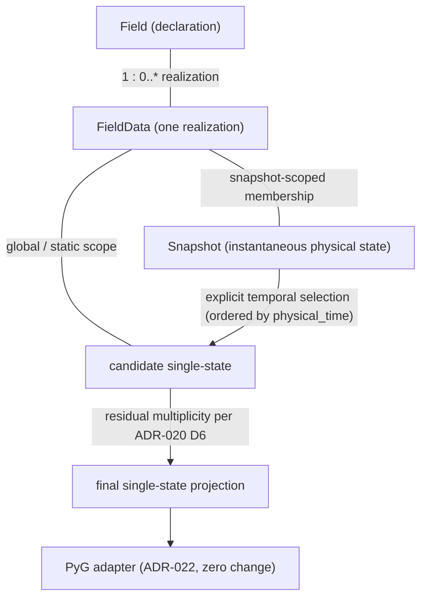

# ADR-023: Snapshot temporal organization over realizations

- 编号：ADR-023
- 标题：冻结 canonical temporal organization over realizations——Snapshot（graph-level instantaneous-state organization construct）以显式 membership 作为瞬时状态唯一 authoritative relation（非拥有型 organization relation；temporal membership 核心映射 `snapshot-scoped FieldData -> exactly 1 Snapshot`）、snapshot identity / physical_time / solver_step 语义分离、scope 显式二分（global/static ‖ snapshot-scoped）、`FieldData.timestep` 为无 canonical temporal authority 的 legacy / compatibility 成员、explicit Snapshot temporal selection → candidate state → residual non-temporal multiplicity 依 ADR-020 D6 显式消歧 → final single-state canonical CAEGraph projection（满足 ADR-022 现有 input contract，adapter 零修改）；不冻结存储 / 容器 / 写入口 / API / 视图实现形态
- 日期：2026-10-05
- 状态：**proposed（2026-10-05 草案；本 ADR 止于 proposed 报 PM 裁决，不进入合入）**
- 关联：ADR-018（六领域概念组成——Snapshot 不新增概念计数，见 D-01 原文引用）、ADR-007（D6 六抽象清单——Snapshot 不新增计数）、ADR-020（1:0..* 语义基数不变、D4 canonical data flow、ownership / container / storage 不冻结、D6 显式选择纪律）、ADR-021（realization families——Snapshot 成员仍是 FieldData，family 语义不变）、ADR-022（D-05 zero-selector 与 D-06 declaration-only 零足迹零修改；其不覆盖项 temporal view microdecision 由本 ADR 承接）、Phase 2、Design UML `class_diagram.puml`（随未来 temporal coding dispatch 具体化）

## Mental Model

## 背景（Context）

- **FACT-01**：ADR-022 不覆盖项明文将 temporal view（realization 排序 / 窗口 / 选择）列为另立 microdecision，并记录三触发条件（首个合法消费 >1 realization 的 consumer 出现；首次需要 temporal ordering / window / selection；gate 6 引入 temporal dataset / window——满足其一即立项）。transient CAE 数据需求已使触发条件满足，本 ADR 即该 microdecision 的立项与裁决（PM 2026-10-05 派单）。
- **FACT-02**：现行实现 `FieldData.timestep: float | None`（`core/field.py`——int / float、bool 拒绝；`None` = 未声明时间）；canonical representation 中**无任何瞬时状态结构**——`CAEGraph._field_data` 为扁平 append-only list（`core/caegraph.py`），builder 明文多 realization 存储不静默选择（ADR-020 D6），构造期零时间校验。
- **FACT-03**：跨 Field 同一时刻的 realization 仅能靠消费端 timestep 数值相等推导——瞬时状态是消费约定而非 canonical 结构关系；且「无 timestep」语义歧义（steady 还是漏注册不可判定）。
- **FACT-04**：ADR-020 冻结 Field : FieldData = **1:0..\*** 语义基数（Field 为 name / unit / association / component semantics 唯一真源）、realization data 位于 canonical data flow 且 ownership / container / storage 不冻结；ADR-018 冻结 CAEGraph 语义组成 = **六领域概念** + referenced topology subsystem，其澄清注记（2026-10-01，ADR-020）明确「Fields 仍为一个领域概念（由 Field 与 FieldData 共同承载），FieldData 不构成第七领域概念」；ADR-007 D6 六抽象清单经 ADR-020 局部取代后明文「FieldData 为 Field 概念的 realization 成员，不新增计数」。
- **FACT-05**：ADR-022 D-05 冻结 adapter 多 realization 一律 fail-fast、零 selector、无 timestep 豁免；D-06 冻结 declaration-only 零足迹；二者零修改保留（见「兼容性核实」）。
- **FACT-06**：`dataset/` 与 `transforms/` 当前为空包（仅 `__init__.py`）——temporal Dataset / window 实现全部未建。

## 范围（Scope）

本 ADR 冻结 canonical temporal organization 的**语义层**：Snapshot membership、scope、snapshot identity / physical_time / solver_step 语义、global ordering、explicit Snapshot temporal selection 与 single-state projection 的形成契约；不冻结任何存储结构、容器形态、写入口、API 与视图实现（见不覆盖项）。本 ADR 只处理 realization 的**时间维度组织**：不将 multiple realization 整体重定义为 multiple timestep，不打开 mesh / mesh-free representation form 议题，不处理第二 realization axis（ensemble / multi-source / multi-fidelity）的**组织机制**——该类 realization 的合法存在不受本 ADR 限制（D-05）；Snapshot 只组织 FieldData 属于哪个 instantaneous state，**不限制同一状态内的第二 realization axis**。

## 问题（Issues）

- **ISSUE-01**：瞬时状态无 canonical 结构表达——跨 Field 同刻 realization 的归属关系只能由消费端数值推导（FACT-03）。
- **ISSUE-02**：时间概念被压缩——snapshot identity、physical time、solver step 三种语义混于单一 float `timestep`；无时间信息时语义不可判定。
- **ISSUE-03**：steady / transient 共存无 scope 语义——为逐帧完整而复制 steady realization，或以缺失时间信息隐式推断 steady，两者均无契约依据。
- **ISSUE-04**：temporal selection 职责未定——选择若入 adapter 即违 ADR-022 D-05；需在 adapter 之前完成 temporal selection 与 residual multiplicity 消歧，且 final projection 须满足既有 adapter input contract 以避免修改 ADR-022。

## 决策（Decision）

### D-01 Snapshot = canonical realization organization construct

**一句话结论**：Snapshot 是 **graph-level 的 canonical realization organization construct**——以显式 membership 组织既有 FieldData、表达「这些 realization 属于同一瞬时物理状态」；**不构成新的领域概念**。

**展开解释**：定位依据为既有 ADR 原文：ADR-018 冻结「CAEGraph 的语义组成由六个领域概念和一个被引用的 topology subsystem 构成」，其澄清注记（2026-10-01，随 ADR-020 采纳生效）明确「Fields 仍为一个领域概念（由 Field 与 FieldData 共同承载），FieldData 不构成第七领域概念」；ADR-007 D6 六抽象清单经 ADR-020 局部取代后明文 realization 成员「不新增计数」。Snapshot 沿同一纪律：**不新增 ADR-018 所定义的 physical-domain concept category，不增加 ADR-018 / ADR-007 的领域概念计数**；Snapshot 新增的是 **realization temporal organization semantics**（「哪些 realization 共同构成一个 instantaneous physical state」的 canonical 组织语义），而不是新的物理领域对象类别——realization 语义仍由 Field / FieldData 承载。temporal organization 为**可选结构**：无 Snapshot 的 canonical representation 合法（steady-only / declaration-only 现状不变）；引入 Snapshot 组织时受本 ADR 约束。

### D-02 Snapshot identity / physical_time / solver_step 语义分离

**一句话结论**：snapshot identity、physical_time、solver_step 三者**语义分离，不得相互替代**——snapshot identity 表示瞬时状态身份，不由 physical_time 或 solver_step 替代或派生；physical_time 表示物理时间，是 canonical temporal ordering 的唯一坐标；solver_step 表示可选的数据源 / 求解器步号；Phase 2 temporal organization 中每个 Snapshot 必须携带 **physical_time**，且同一 temporal organization 内 **physical_time 值唯一**；非等间隔 physical_time 合法；solver_step optional。

**展开解释**：identity 回答「这是哪个瞬时状态」——由 Snapshot 的结构身份承载，不由 float 值或步号承担；physical_time 回答「该状态对应什么物理时间」——是 global ordering 的唯一坐标（D-08）；solver_step 回答「数据源 / 求解器中的步号」——纯来源标注，不承担 Snapshot identity。三者的具体成员形态不冻结（不覆盖项）。

### D-03 membership 定义瞬时状态

**一句话结论**：**Snapshot membership 是 snapshot-scoped FieldData「属于哪个 instantaneous physical state」的唯一 authoritative relation**；temporal membership 的核心映射为 **`snapshot-scoped FieldData -> exactly 1 Snapshot`**——每个 snapshot-scoped FieldData 显式且唯一地属于 exactly 1 Snapshot（membership 单值，违反即 fail-fast）；一个 Snapshot 关联 **0..*** 个 snapshot-scoped FieldData；global-scoped FieldData 不属于任何 Snapshot。

**展开解释**：membership 是定义性结构关系，**不引入时间数值参与判定**——同一 Snapshot 的成员即同一瞬时状态，无论其时间标注如何；本 ADR 不使用也不引入 `(Field, t)` 类时间值判据。Snapshot ↔ FieldData 是 **non-owning organization / membership relation**：不改变 ADR-020 已冻结的 `Field 1 : 0..* FieldData` 语义基数；不冻结引用方向、存储位置、registry / container 形式或 accessor 方向；即使未来同时提供正向与反向访问，也**不得形成两个可独立修改的 membership truth sources**。**本 ADR 不冻结 `(Snapshot, Field)` 维度的任何 cardinality**：同一 Snapshot 内同一 Field 出现多个 FieldData 表示 **residual non-temporal multiplicity**——其存在合法（第二 realization axis 的组织机制继续 deferred，D-05），temporal organization 不在 representation 层将其判非法，由 D-08 / ADR-020 D6 在形成最终 projection 时消歧。Snapshot 成员数无下限（部分乃至全部 Field 缺席合法，见 D-06）。

### D-04 scope 显式二分

**一句话结论**：每个 FieldData **恰属一个 scope**——**global / static realization**（不属于任何 Snapshot）或 **snapshot-scoped realization**（恰属一个 Snapshot）；scope 是显式声明的结构属性，**禁止以「缺失时间信息」推断 steady**；**Phase 2 temporal profile 中，同一 Field 不得同时拥有 global 与 snapshot-scoped realizations**（一致性校验 fail-fast）。

**展开解释**：scope 二分消除「无 Snapshot membership」的歧义——一个 FieldData 要么显式 global、要么显式 snapshot-scoped，不存在「本来 transient 但尚未被正确注册」的中间态。**披露：本条的 per-Field scope 禁混是 ADR-023 在 Phase 2 temporal profile 中新增的合法性收窄，也是本 ADR 唯一一处 Phase 2 合法性收窄**（用于避免 global / transient override 与 precedence 歧义）——ADR-020 D6 只冻结「多 realization 可存于 representation、要求唯一 realization 的消费须显式选择或失败」，未裁决 temporal scope 混存；未来若需混存须显式新决策。本 ADR 冻结的是 **scope / membership / consistency validation 义务**：无论写入口是什么，上述约束必须被构造期或一致性校验强制；**不冻结任何特定对象为永久唯一 temporal 写入口**（含 MeshRepresentationBuilder——承袭 ADR-020 ownership / container / storage 不冻结立场）。

### D-05 non-temporal multiplicity 与 ADR-020 D6 的关系

**一句话结论**：**ADR-023 只解决 temporal realization organization；non-temporal realization multiplicity 不由本 ADR 限制**——同一 global Field 可以合法拥有多个 FieldData，继续满足 ADR-020 D6。

**展开解释**：ensemble / multi-source / multi-fidelity 等第二 realization axis 的**组织机制**继续 deferred；**deferred 一个组织机制不等于禁止该类 realization 合法存在**。若 Snapshot temporal selection 完成后某 Field 仍有多个 eligible FieldData（residual non-temporal multiplicity），则依据 ADR-020 D6 在领域层**显式选择或显式失败**；adapter 不负责 residual non-temporal multiplicity 的选择（见 D-08）。跨时间的多 realization 由 Snapshot 组织承载（与 ADR-020 D6 的多 realization 存储合法性一致，见兼容性核实）。

### D-06 Snapshot 缺 Field 合法（scope 限定）

**一句话结论**：**snapshot-scoped Field 在所选 Snapshot 中无 realization 时**合法——single-state projection 中该 Field 保持 declaration-only，由 ADR-022 D-06 零足迹语义接管；**global-scoped Field 不以 Snapshot membership 判断缺失**——其 eligible realizations 按 D-08 进入 candidate state；**不要求不同 Snapshot 字段同构**。

**展开解释**：「Snapshot 中无成员」仅就 snapshot-scoped 而言，**不等同于**「projection 中 declaration-only」——global-scoped Field 的缺席判定与其是否属于任何 Snapshot 无关，二者不得混淆。canonical temporal state 的完整性要求归下游 consumer（Dataset / transforms 层自定充分性判定）；不得为 batching 或训练便利要求字段完全同构。

### D-07 `FieldData.timestep` = 无权威的 legacy / compatibility 成员

**一句话结论**：`FieldData.timestep` 当前成员**暂时保留为 legacy / compatibility member**——不参与 Snapshot membership、不参与 physical_time / global ordering、不参与跨 Field temporal alignment、不参与 Snapshot selection，**不具有 canonical temporal authority**；ADR-023 **不定义** `FieldData.timestep` 与 `physical_time` 的映射关系，也**不定义**其与 `solver_step` 的映射关系；timestep 的长期语义、迁移或退役继续 deferred。

**展开解释**：canonical temporal 职能由 Snapshot（membership + physical_time，D-02 / D-03 / D-08）唯一接管——时间组织语义只有一个权威来源，本 ADR 不在两个未定义语义的来源之间建立任何 canonical 映射或同步义务。若某个具体数据 source 明确知道其 legacy timestep 等价于其 solver step，该等价性校验属于 **source normalization / migration contract**，不属于 CAEGraph canonical temporal invariant。Phase 2 现有构造签名与成员集零变化（ADR-020 D2 本不冻结成员形态）。

### D-08 global ordering 与 single-state projection 的形成

**一句话结论**：canonical global ordering = **同一 temporal organization 内按 physical_time 升序**（唯一性由 D-02 支撑；下标、注册顺序、solver_step 均不构成时间序）；single-state projection 的形成是一条**显式链路**——explicit Snapshot temporal selection → candidate state → residual multiplicity 消歧（ADR-020 D6）→ **final single-state canonical CAEGraph projection（必须满足 ADR-022 现有 input contract）**；**adapter 零修改、zero-selector**；projection 的实现形态（copy / lazy view / 共享 topology / 其他）不冻结。

**展开解释**：**D-03 保证每个 snapshot-scoped FieldData 已被唯一归入一个瞬时状态**（`snapshot-scoped FieldData -> exactly 1 Snapshot`）——但这不消除同一状态内的 global / source / fidelity / ensemble 等 **non-temporal multiplicity**。形成过程：① **explicit Snapshot temporal selection**——candidate state 收集所选 Snapshot 的**全部成员**以及 **eligible global realizations**（global 不逐帧复制、各状态共享）；② 此时同一 Field 可以存在 **0 / 1 / >1** 个 eligible FieldData——**0**：合法，保持 declaration-only，由 ADR-022 D-06 zero-footprint 接管；**1**：合法，正常进入最终 state；**>1**：residual non-temporal multiplicity，依据 ADR-020 D6 在领域层**显式选择或显式失败**，**不允许把 >1 情况传给 adapter 再让 adapter 选择**；③ 消歧完成后才形成满足 ADR-022 input contract 的 **final single-state canonical CAEGraph projection**。final projection 满足 ADR-022 D-01 profile（CAEGraph canonical representation、`validate()` 通过、cell-based topology provider、`n_entities ≥ 1`）与 **ADR-022 D-05** 输入前提（每 Field 至多一个 realization，0 合法——由 ② 的消歧结果保证），因此**无需修改 ADR-022 任何条款**；多 realization 原图直接进入 adapter 仍 fail-fast（ADR-022 D-05 原样）。选择与消歧均发生在 adapter 之前；adapter 不知道也不需要知道「为什么这一帧被选择」。selection / ordering / projection 的具体 API 与视图类型 defer Design UML / implementation（不覆盖项）。

## 义务分界（canonical temporal organization 与 Dataset / transforms）

- **canonical temporal layer（本 ADR，representation 侧）**：Snapshot organization（membership / scope）、global ordering、explicit Snapshot temporal selection（→ candidate state）、snapshot iteration（可访问的时间顺序）。
- **residual non-temporal multiplicity 消歧**：要求唯一 realization 的领域消费路径义务——依 ADR-020 D6 显式选择或显式失败（D-05 / D-08）；发生在 adapter 之前。
- **Dataset 层**：window size / stride / history length / prediction horizon / target construction / sequence sampling strategy——ML window semantics 不得进入 FieldData 或 Snapshot 定义。
- **transforms 层**：窗口内派生编码。
- **adapter**：忠实物化，零修改（ADR-022）。

## 兼容性核实（对既有契约逐条核对）

| 既有契约 | 原文要点 | 本 ADR 影响 |
| --- | --- | --- |
| Field : FieldData = 1:0..*（ADR-020 标题行冻结语义基数） | 「1:0..* 关系……Field 为 name/unit/association/component semantics 唯一真源」 | **不变**——Snapshot 对 FieldData 是**非拥有型 organization / membership relation**，只组织既有 realization，不改变 Field → FieldData 的语义基数与真源关系 |
| ADR-020 D4 canonical data flow | 「realization data 位于 CAEGraph canonical data flow……ownership / container / storage 不冻结」 | **承袭**——Snapshot membership 属 canonical organization 语义；存储 / 容器形态本 ADR 同样不冻结（D-04） |
| ADR-020 D6 | 「representation construction 可合法保存多个 realization；要求唯一 realization 的消费须显式选择或显式失败」 | **保持并显式适用**——global / non-temporal multiple realizations 在 canonical representation 中继续合法；Snapshot 只组织 FieldData 属于哪个 instantaneous state，**不限制同一状态内的第二 realization axis**；temporal selection 后仍存在多个 eligible realization 时，继续依据 ADR-020 D6 显式选择或失败（D-05 / D-08）；D6 明文「eligible 判定与显式选择机制不冻结」，本 ADR 即其 temporal 轴裁决 |
| ADR-018 六领域概念 / ADR-007 D6 六抽象 | 「Fields 仍为一个领域概念……FieldData 不构成第七领域概念」（ADR-018 注记）；「不新增计数」（ADR-007 D6） | **不变**——Snapshot 沿同一纪律，为 organization construct，不增两处计数（D-01 引用原文） |
| ADR-022 D-05 / D-06 | 多 realization 一律 fail-fast、零 selector、无 timestep 豁免；declaration-only 零足迹 | **零修改**——selection 前置（D-08），原图直入 adapter 行为不变；snapshot-scoped Field 在所选 Snapshot 中缺成员由 D-06 零足迹接管 |
| ADR-022 不覆盖项 temporal view | 「另立 microdecision，立项触发：①②③满足其一即立项」 | **承接**——本 ADR 即该 microdecision 立项；ADR-022 正文零修改 |
| **一处 Phase 2 收窄（显式披露，非既有冻结事实）** | — | 仅 D-04 per-Field global / snapshot scope 禁混——ADR-023 新增 profile 限制（D-04 正文已披露） |

## 本 ADR 不覆盖项（scope exclusions）

- Snapshot / scope / membership 的存储结构与容器形态（list / dict / 其他）、HDF5 layout、lazy loading、内存策略；
- temporal 写入口机制（含 builder 是否参与、以何种方式参与）——本 ADR 只冻结结构义务（D-04）；
- 具体 API（`add_snapshot()` / `assign_snapshot()` / `snapshot()` / `iter_snapshots()` 等）与 `SnapshotView` 等视图类型；整帧注册 vs 逐 FieldData 归属的实现方式；
- projection 实现形态（copy / lazy view / 其他）与 selection API 形态（D-08）；
- snapshot identity / physical_time / solver_step 的具体成员形态（D-02）；
- Dataset window 语义（window size / stride / history / horizon / target / sampling）与 Dataset 实现；
- 第二 realization axis（ensemble / multi-source / multi-fidelity）的**组织机制**——该类 realization 的合法存在不受本 ADR 限制（D-05；含同一 Snapshot 内同一 Field 多 realization 的场景）；
- `FieldData.timestep` 的长期删除或迁移（D-07）；
- `FieldData.timestep` 与 `physical_time` / `solver_step` 的映射关系（本 ADR 不定义；source 侧等价性校验属 source normalization / migration contract，非 canonical invariant——D-07）；
- PyG 单帧时间标注的键呈现（仍 defer——ADR-022 D-02 键集封闭，本 ADR 不改其正文）；
- mesh / mesh-free representation form（独立议题，明确不打开）。

以上各项禁止提前实现接口等待未来确认；纳入决策范围须专门架构决策。

## 备选方案（Options considered）

| 方案 | 结论 | 原因 |
| --- | --- | --- |
| A. `FieldData.timestep` 作时间真源，按时间数值派生 frame（前案） | 否决 | 瞬时状态沦为消费端推导约定，非 canonical 结构关系；float 相等脆弱且「无 timestep」语义不可判定（steady 还是漏注册）；snapshot identity、physical time 与 solver step 的语义被压缩进单一 float |
| B. graph-level Snapshot membership（本案） | 采纳 | membership 是定义性结构关系——canonical representation 显式表达「同一瞬时状态」；snapshot identity / physical_time / solver_step 各归其位；steady / transient scope 显式；final projection 满足既有 adapter input contract，ADR-022 零修改 |
| B'. 时间容器复制时间值（TemporalFrame 持有 t，成员各自保留时间） | 否决 | 物理时间双份存储 → 第二时间真源 |
| C. adapter 内扩展时间选择 / 排序 | 否决 | 直接违反 ADR-022 D-05 冻结 |
| D. 继续 defer 至 Dataset 实现期 | 否决 | 立项触发条件已满足（FACT-01）；无契约则 gate 6 temporal dataset 无验收对照物 |

## 影响（Consequences）

- 新能力：transient 数据的 canonical 组织——同一瞬时状态显式结构化、global ordering、explicit Snapshot temporal selection；global realizations 不逐帧复制、各状态共享（其多实例合法性不受限，D-05）。
- 成本：一个未来 temporal organization coding dispatch（Snapshot membership / scope 校验、selection → candidate state、residual multiplicity 消歧 → final projection 的实现与守卫测试——`ADR-023-invariants.yaml` TEST_MISSING 条目的证据落点）；Design UML 随该 dispatch 具体化。
- residual non-temporal multiplicity 消歧成为领域消费路径义务（ADR-020 D6，adapter 之前完成）。
- `FieldData.timestep` 定位为无权威 legacy / compatibility 成员（现有签名零变化；与 physical_time / solver_step 的映射本 ADR 不定义，长期迁移 deferred）。
- ADR-020 / ADR-021 / ADR-022 正文零修改；一处 Phase 2 收窄显式披露（D-04 per-Field scope 禁混）。
- Dataset / transforms 层获得明确上游契约（义务分界）；window 语义归 gate 6 及以后。
- 不改变依赖分层与 PyG 边界（ADR-007 D2）。

## Invariant 登记策略

- **eligibility 判断（本 ADR 独立作出）**：仅登记当前已可判定、且不引用任何 deferred API / container / view / projection 实现形态的约束，TEST_MISSING 初版与本文档同 commit；守卫测试随未来 temporal organization coding dispatch 经 PM 授权回填，证据同步永不与 feat 同 commit：D-02 physical_time 必在与同组织内唯一（D02-01）；D-03 temporal membership cardinality——`snapshot-scoped FieldData -> exactly 1 Snapshot`（D03-01）；D-04 scope 二分（D04-01）与 per-Field scope 禁混 fail-fast（D04-02）；D-07 Snapshot membership 与 `FieldData.timestep` 数值无关（语义 invariant，D07-01）。「global-scoped FieldData 不属于任何 Snapshot」已由 D04-01 的 scope 二分完整覆盖，不重复登记。
- **不登记**（eligibility 排除）：ordering / selection / projection 条目——其可执行形态依赖 deferred 的视图与选择 API（含「ordering / selection 是否读取 timestep」类实现路径）；snapshot identity 成员形态、迭代 API，以及「实现是否读取某属性」类实现行为同理由不登记。
- Markdown ADR 仍是唯一决策真源；YAML 只作机器可读核验索引，禁止反向冻结本 ADR 的不冻结项。

## 修订历史（Revision history）

- 2026-10-05 v1：草案（proposed）——经方向比较采纳 Snapshot membership 方案（timestep 数值分组派生 frame 前案否决，理由存档于备选方案表）；冻结 D-01..D-08 的 canonical temporal organization 契约，`ADR-023-invariants.yaml` 同 commit 创建 TEST_MISSING 初版（eligibility 判断见上文登记策略）。
