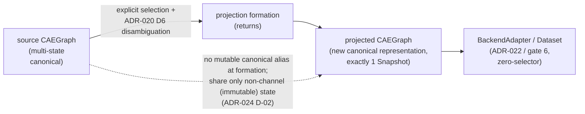

# ADR-024: Single-state projection materialization and isolation

- 编号：ADR-024
- 标题：冻结 single-state temporal projection 的 representation / lifecycle contract——projection 产物是拥有独立 canonical state 的新 canonical CAEGraph representation（非 source 的 mutable view 或 alias）；projection operation 创建、保留或携带进入 projected representation 的 canonical state 在 formation 时与 source 间不存在 mutable canonical alias，且对该 state 的合法 projected-side 公共 mutation 不得回写 source（共享仅限不构成 canonical mutation channel 的 immutable state；「referenced / non-owning」不自动推导共享或复制）；Snapshot 与 snapshot-scoped FieldData 在 projected representation 中独立 materialize（对齐 ADR-023 D-03 exactly-one，不创造第二 membership truth）；realization-independent canonical semantics 必须保留；不冻结任何 materialization mechanism——仅收窄 ADR-023 D-08 明确 deferred 的 final-projection implementation-form 空间
- 日期：2026-10-05
- 状态：**accepted（2026-10-05 经 PM 裁决采纳，随任务分支落盘）**
- 关联：ADR-023（D-08 deferred implementation-form 空间的收窄、D-03 exactly-one 的 projection-scoped specialization；正文零修改）、ADR-022（D-01 input profile 承接；D-05 / D-06 零修改）、ADR-020（D3 Field 语义唯一真源、D6 显式消歧纪律原样）、ADR-018（ownership 总则的 cross-representation 外延）、ADR-014（拓扑事实结构冻结——共享资格前提）、ADR-019（entity identity 经 D-04 preservation 覆盖）、Dispatch ②（`ae94d06` / `f3a5972` gap evidence）、Design UML `class_diagram.puml`（CAEGraph note 随本 ADR 具体化）

## Mental Model

## 背景（Context）

- **FACT-01**：ADR-023 D-08 冻结了形成链路（explicit Snapshot temporal selection → candidate state → residual multiplicity 依 ADR-020 D6 显式消歧 → final single-state canonical CAEGraph projection，必须满足 ADR-022 现有 input contract），并明文「projection 的实现形态（copy / lazy view / 共享 topology / 其他）不冻结」（正文 D-08 与 scope exclusions；`ADR-023-invariants.yaml` explicitly_not_frozen）。该条款留白的是**机制**；但 projection 与 source 之间的 consumer-visible lifecycle / aliasing 契约——view 还是独立 representation、允许何种对象共享、projected 侧 mutation 是否回写、preservation 义务边界——在任何 accepted ADR 中均无出处。
- **FACT-02**：Dispatch ② 实证 gap——`ae94d06` 按 by-design aliasing 实现（topology provider 与 Field declaration 对象按引用共享，graph-level metadata 被静默丢弃；原 docstring：「By-design aliasing: Field declarations and the topology provider are referenced non-owning objects (ADR-018/014) shared with the original…」），约 17 分钟后 `f3a5972` 反转为全量 deep-copy materialize。两套相反结论均可从既有 ADR 局部推导，且 `ae94d06` 的 metadata 丢失构成一次真实 silent loss。
- **FACT-03**：跨 representation 的 aliasing 纪律无出处——ADR-018 的 ownership 总则只管辖单个 representation 内部的组成与归属；ADR-020 D3 / D4 明文不冻结 identity / reference 机制；ADR-023 D-03 的「不得形成两个可独立修改的 membership truth sources」仅限 membership truth 一域。
- **FACT-04**：下游需要稳定边界——ADR-022 Stage 3 adapter（gate 4b）以 projection 为唯一领域输入；gate 6 Dataset 将对同一 source 反复形成 single-state projection（transforms 层需在窗口上合法 mutate）；未来性能优化要求在不修改契约的前提下共享真正 immutable 的 state。
- **FACT-05**：当前公共 mutation 表面（事实记录，非契约）——`CAEGraph` / `Field` / `Mesh` / `BoundaryRegion` 均经 `BaseObject.update_metadata` 提供公共 metadata mutation；`FieldData.values` 按引用返回；`Mesh` 表存储结构冻结（ADR-014 决策 7）无表级 mutator；`BoundarySpec` 的 `value` / `weight` 仅允许 numeric 或 `None`、`parameters` 仅允许 numeric mapping 且构造期建立新 dict、accessor 返回 defensive copy、region / paired_region 为 canonical name（binding cache 由 manager 生命周期重解析）。

## 范围（Scope）

本 ADR 只冻结 single-state temporal projection 的 **representation / lifecycle contract**——isolation result 与共享判据（consumer-visible），以及 temporal 成员 materialization 与语义 preservation 义务；不冻结任何 materialization mechanism，不修改 ADR-023 已冻结的 temporal semantics，不打开 Dataset / adapter / NumPy 议题（见不覆盖项）。

## 问题（Issues）

- **ISSUE-01**：projection 形态无契约——view / alias / 独立 representation 三种理解均可从既有 ADR 局部推导（FACT-01 / FACT-02），两套相反实现已在 Dispatch ② 先后出现。
- **ISSUE-02**：mutable alias 无禁令——projected 侧经公共 API 的合法 mutation 能否修改 source canonical state 无裁决；implementation 在无契约状态下依赖静默选择的复制深度。
- **ISSUE-03**：temporal 成员跨 representation 归属未显式——snapshot-scoped FieldData instance 能否同时是 source Snapshot 与 projected Snapshot 的 authoritative member，依赖对 ADR-023 D-03 的跨域解读，原语境仅为单 representation 写入口（FACT-03）。
- **ISSUE-04**：preservation 义务无边界——realization-independent canonical semantics 是否必须保留、保留到什么程度无契约；`ae94d06` 已实际发生 graph-level metadata 的 silent loss（FACT-02）。

## 决策（Decision）

### D-01 Projection form（projection 是新的 canonical representation）

**一句话结论**：single-state temporal projection 的产物是一个**新的 canonical CAEGraph representation**——拥有自身 canonical state 的独立 CAEGraph 实例（满足 ADR-022 D-01 input profile，该点 ADR-023 D-08 已冻结）——而不是 source representation 的 mutable view 或 alias；source 与 projection 是两个并列的 canonical representation。

**展开解释**：candidate state 是形成链路的中间态（ADR-023 D-08），不要求为 representation，也不引入新架构类。「不是 mutable view」是 consumer-visible 判定：projection 的 canonical state 不与 source 共享任何可变真源；它不排除任何能交付本 ADR isolation result 的实现机制（一次成型复制、copy-on-write、惰性求值后分叉等均可）。

### D-02 Mutable-alias isolation（隔离结果与共享判据）

**一句话结论**：本条约束 **projection operation 创建、保留或携带进入 projected representation 的 canonical state**——projection 形成时（返回点），这些 state 与 source representation 的 canonical state 之间**不存在 mutable canonical alias**；对 projection-produced / projection-preserved state 的合法 projected-side 公共 mutation **不得回写** source canonical state。两个 representation 之间仅允许共享**不构成 canonical mutation channel** 的对象（经双方全部公共 API 都不可能发生 mutation 的 state）；「referenced / non-owning」本身既不推导「允许共享」，也不推导「必须复制」。

**展开解释**：本条冻结的是 formation 时刻的 isolation result 与 projection-owned state 的回写禁令，**不是**对 projected CAEGraph 全部公共 API 的 lifetime-wide defensive-copy 保证——projection 完成后 consumer 主动将 source-owned mutable object 重新注入 projected representation（如经既有挂载 API 关联 source 侧 Field 对象）属 consumer 行为，不在本 invariant 范围。共享合法性唯一判据是「该对象在双方当前公共表面上是否可能成为 mutation 通道」：对象真正 immutable 后共享即自动合法（无需修改本 ADR）；存在公共 mutation 路径的对象不得由 projection operation 携带共享——各 representation 独立 materialize 该语义，materialize 方式不冻结。不共享任何 channel 对象时，isolation result 双向自然成立：任一侧对各自 state 的 mutation 都不可见于另一侧。representation 内部与跨 representation 的引用语义（ADR-020 D3、ADR-018 topology provider 引用）不受本条影响——本条只禁止 projection operation 交付「可变别名」这一种关系。

### D-03 Temporal realization isolation（temporal 成员独立 materialize）

**一句话结论**：projected representation 中的 Snapshot 与 snapshot-scoped FieldData **独立 materialize**——同一个 snapshot-scoped FieldData instance 不得同时是 source Snapshot 与 projected Snapshot 的 authoritative member；projected representation 恰含一个 Snapshot，携带所选 Snapshot 的 temporal coordinates（physical_time 必带、solver_step optional，ADR-023 D-02），其成员各自满足 exactly-one membership。

**展开解释**：本条是 ADR-023 D-03（`snapshot-scoped FieldData -> exactly 1 Snapshot`，membership 单值 fail-fast）在 projection 场景的直接对齐与 specialization，不创造第二 membership truth，不改写 D-03 任何语义。global-scoped FieldData 不在本条范围内——它们不属于任何 Snapshot（ADR-023 D-03），进入 projection 时保持 global scope、无 membership（ADR-023 D-08 ①），其共享资格由 D-02 的 channel 判据管辖。

### D-04 Semantic preservation（语义保持边界）

**一句话结论**：projection 只收窄 realization state——按 ADR-023 D-08 选择单一瞬时状态、按 ADR-020 D6 显式消歧 residual multiplicity；除此之外不得静默丢失与所选时间状态无关的 canonical problem semantics 与 graph-level annotations：topology subsystem 的拓扑事实（存在时）、全部 Field declarations（name / unit / association）、boundary semantic regions 与 condition specs（binding 语义解析到 projected representation 自身的 regions）、graph-level identity / relation / category 事实（含 n_entities / edges / node_categories）、graph-level metadata annotations，以及进入所选状态的各 realization 自身的 realization metadata（含 `FieldData.timestep` legacy 成员的如实保留，不赋予 temporal authority）。

**展开解释**：preservation 是**语义等价**要求（consumer-visible 内容等价），不是对象复制要求——某项内容由共享满足还是由独立 materialize 满足，由 D-02 判据决定；本条不把任何 constructor / copy 实现写进 contract。两类收窄是既有 ADR 明确授权的，不构成 silent loss：非所选 Snapshot 的 realization 不进入 projection（ADR-023 D-08）；residual >1 消歧后的落选 realization 不进入（ADR-020 D6）。snapshot-scoped Field 在所选状态中无 realization 时保持 declaration-only（ADR-023 D-06），declaration 本身必须保留。

## 术语（Terminology）

- **ownership（归属）**：成员在哪一个 representation 的 canonical state 中具有 authoritative 地位——representation 内概念（ADR-018 总则管辖内部组成；本 ADR 管跨 representation 关系）。
- **reference semantics（引用语义）**：成员可引用非本方拥有的对象以完成语义（FieldData 经 Field 解析语义，ADR-020 D3；CAEGraph 引用 topology provider，ADR-018）。引用既不蕴含共享同一对象，也不蕴含复制。
- **mutable aliasing（可变别名）**：同一对象同时处于两个 representation 的 canonical state 中，且经任一侧公共 API 的 mutation 可在另一侧被观察到——**唯一被禁止的关系**。判定矩阵：non-owning + 经公共表面不可变 → 可共享；non-owning + 存在公共 mutation 路径 → 不得作为共享 canonical state（各 representation 独立 materialize 该语义，方式不冻结）；「referenced / non-owning」本身两个方向都推不出。

## 义务分界（projection contract 与下游）

- **projection operation（canonical temporal layer，ADR-023 D-08 链路）**：在 formation / 返回点交付满足 D-01..D-04 的 projected representation；契约义务至 formation 终止（consumer 事后行为出界）。
- **consumer（adapter / transforms / Dataset）**：projected representation 是独立 canonical representation——可合法 mutate 其 projection-owned state（D-02）；不得依赖「projection 持续跟踪 source 演化」。
- **未来性能优化**：引入 shared immutable substrate 只受 D-02 channel 判据约束——Mesh 拓扑事实已结构冻结（ADR-014 决策 7），Field / FieldData / declaration 未来经专门决策 immutable 化后共享即刻合法，无需修改本 ADR。

## 兼容性核实（对既有契约逐条核对）

| 既有契约 | 原文要点 | 本 ADR 影响 |
| --- | --- | --- |
| ADR-014（mesh data model） | 决策 1 / 6「派生视图 / 缓存不具独立身份，永不构成第二套编址体系 / 真源」；决策 7「结构冻结、场可追加」 | **不冲突**——未触及 cross-representation 对象关系；其结构冻结恰是拓扑事实在 D-02 判据下可共享的前提；D-01 与「派生视图非真源」纪律同向 |
| ADR-018（domain composition） | topology subsystem referenced not owned；fields associated；conditions by reference；实现形态开放 | **不冲突**——ADR-018 只管辖单 representation 内部组成归属；本 ADR 是其 cross-representation 外延补充 |
| ADR-019（entity relation model） | entity identity（node / cell ID = Mesh 索引），不重复存储 | **不冲突**——entity identity 事实由 D-04 preservation 覆盖 |
| ADR-020（field declaration / realization split） | D1 Field 唯一语义真源；D3 identity / reference 机制不冻结；D4 归属语义冻结止于「canonical data flow 可访问」；D6 显式选择纪律 | **不冲突**——projected declaration 与 source declaration 各自在所属 representation 内 authoritative，语义等价（D-04）；D6 消歧原样发生在 formation 之前；其不冻结立场被尊重 |
| ADR-022（PyG backend representation contract） | D-01 input profile；D-05 fail-fast zero-selector；D-06 declaration-only 零足迹 | **不冲突、正文零修改**——projection 满足 profile 已由 ADR-023 D-08 冻结；D-04 preservation 使 declaration-only 零足迹语义原样成立 |
| ADR-023（snapshot temporal organization） | D-01..D-08 temporal semantics；D-08 明文 deferred「projection 的实现形态」 | **不修改任何已冻结 temporal semantics（D-01..D-08 原样有效）**；本 ADR 仅收窄 ADR-023 明确 deferred 的 final-projection implementation-form 空间——任何 copy / copy-on-write / lazy-materialization / shared-immutable-substrate 机制均可采用，但最终交付物必须满足 D-01 / D-02 的 result contract；pure always-live mutable view 因无法满足该 result contract（会随 source 演化增删 Snapshot / realization，既非 single-state 也不可隔离）而被排除。ADR-023 正文零修改；本关系由本 ADR 的「关联」与本表承载 |
| **一处实现形态收窄（显式披露，非合法性收窄）** | — | pure always-live mutable view 被排除出 projection 实现形态——这是对 ADR-023 D-08 deferred 空间的收窄（该空间本就要求「专门架构决策」方可纳入），不是对任何 representation 合法性的限制；ADR-023 的 Phase 2 合法性收窄（D-04 per-Field scope 禁混）不变 |

## 本 ADR 不覆盖项（scope exclusions）

- `project_snapshot()` 方法名与签名；Snapshot object-reference selection API；physical_time lookup API；
- Dataset / window / history / stride / horizon；ADR-020 D6 explicit-selection API；
- second realization axis（ensemble / multi-source / multi-fidelity）；
- Python copy / deepcopy 机制；Python object identity；具体 Field / Mesh cloning helper；NumPy storage / zero-copy policy；
- exception type / message；adapter implementation；source IO；
- 「任一时刻哪些具体对象符合非 channel 共享资格」（由当时公共 mutation 表面推导，随表面演进）；
- projection 完成后的 consumer 行为（含主动重新注入 source-owned mutable object）。

以上各项禁止提前实现接口等待未来确认；纳入决策范围须专门架构决策。

## 备选方案（Options considered）

| 方案 | 结论 | 原因 |
| --- | --- | --- |
| A. 冻结「projection = 全量独立复制」 | 否决 | 把机制写进 contract，封死 immutable sharing / COW 优化空间 |
| B. 冻结 isolation result + mutation channel 判据（本案） | 采纳 | consumer-visible、机制无关、自动适应未来 immutability 演进 |
| C. 维持 ADR-023 现状继续不冻结 | 否决 | Dispatch ② 两套相反实现（`ae94d06` / `f3a5972`）实证 gap；gate 4b / gate 6 需要稳定边界 |
| D. 冻结 projected graph 全部公共 API 的 lifetime-wide defensive-copy 保证 | 否决 | 不可判定且随 API 表面漂移；把 consumer 事后行为错误归入 projection operation 义务；invariant 无法稳定 |
| E. 双向 mutation 互不可见单列独立条款 | 折叠 | 由 channel 判据在 formation 时自然导出，单列对未来机制表述过度约束 |

## 影响（Consequences）

- 新能力：projection 的 consumer-visible isolation result 冻结——gate 4b adapter / gate 6 Dataset / transforms 可安全 mutate projection-owned state 而不腐化 source temporal organization。
- 成本：contract 化守卫测试（formation-time alias 检查 + projection-owned state 回写 battery（D02-01，无 API 枚举）、temporal membership 语义断言（D03-01）、preservation battery（D04-01））随落地 dispatch 完成；现有 `tests/core/test_projection.py` 部分机制级断言（`data.field is not field`、`copy.values is not early.values`、docstring「projection-materialized COPIES (no aliasing)」）作为现机制证据合法，但 invariant 证据回填前需对齐 contract 层。
- 实现自由度保留：deepcopy / COW / lazy-materialization / shared-immutable-substrate 均可；channel 判据自动适配未来 immutability 演进——Mesh 拓扑事实已结构冻结（metadata 通道除外），Field / FieldData / declaration 未来经专门决策 immutable 化后共享即刻合法。
- ADR-020 / ADR-022 / ADR-023 正文零修改；一处实现形态收窄显式披露（pure always-live mutable view 排除，见兼容性核实表）。
- Dispatch ② 现状（`f3a5972` 全量 materialize）从已检查行为看方向上与本 ADR D-01..D-04 对齐；正式合规以 accepted 后的 Coding compliance review 为准（Architecture 不替代代码双审）。
- 不改变依赖分层与 PyG 边界（ADR-007 D2）。

## Invariant 登记策略

- **eligibility 判断（本 ADR 独立作出）**：ADR-023 登记策略曾以「ordering / selection / projection 条目依赖 deferred 的视图与选择 API」排除登记；本 ADR 冻结 result-level contract 后，该阻塞对 result 级陈述解除。登记三条：D-02 formation-time isolation result（D02-01）、D-03 temporal 成员独立 materialize（D03-01）、D-04 semantic preservation（D04-01）——均为当前可判定、且不引用任何 deferred API / mechanism / 具体共享对象的陈述。TEST_MISSING 初版与本文档同 commit；证据随 contract 化 dispatch 经 PM 授权回填，证据同步永不与 feat 同 commit。
- **不登记**（eligibility 排除）：D-01 独立条目——其可执行 residue（产物是 CAEGraph、过 validate、恰一 Snapshot）已被 D02-01 / D03-01 覆盖，「非 view」的操作性内容即 D-02 formation-time 判定，单独登记只会重复；「哪些具体对象符合非 channel 共享资格」——随公共 mutation 表面漂移，不可稳定登记；projection API 名称 / 签名——deferred（不覆盖项）。不因测试方便强行登记。
- Markdown ADR 仍是唯一决策真源；YAML 只作机器可读核验索引，禁止反向冻结本 ADR 的不冻结项。

## 修订历史（Revision history）

- 2026-10-05 v1：草案并经 PM 裁决 accepted——Architecture Planning Report（gap 实证 FACT-01/02、D1–D4 压力测试、各实体语义共享性裁定）经 PM Request Changes 四项修订后批准成文：① D-02 / D02-01 作用域收敛为「projection operation 创建、保留或携带进入 projected representation 的 canonical state」（lifetime-wide defensive-copy 方案作为备选方案 D 显式否决）；② 对 Dispatch ② 现状的合规判断降级为「方向上对齐」，正式合规交由 Coding compliance review；③ BoundarySpec 潜在 channel 项经 contract 核实后删除（value / weight numeric-or-None、parameters numeric mapping + defensive copy、binding cache 重解析），仅保留 regression coverage 建议；④ ADR-023 → ADR-024 的 deferred-space 收窄关系显式化（兼容性核实表）。`ADR-024-invariants.yaml` 同批次创建 TEST_MISSING 初版（eligibility 见登记策略）。
