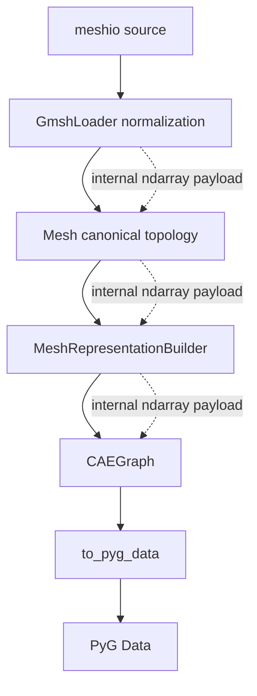

# ADR-025: NumPy-first internal data path

- 编号：ADR-025
- 标题：冻结「NumPy-first 是内部数值表示策略、而非 public API 策略」的表示边界——高容量 numerical / index payload 在实现内部优先保持 NumPy-native，领域语义对象维持 Python semantic shell
- 日期：2026-10-10
- 状态：**accepted**
- 关联：ADR-012 ~ ADR-024；ADR-019 D3（relation 内部 container form 不冻结）；证据归档 `architecture/perf/`（非规范）。

## 心智模型（Mental model）

实线为既有对象链与架构边界（不变）；虚线为高容量 payload 的内部数值承载通道，不出现在任何 public contract 中。

## 背景（Context）

- loader 自有路径（normalization 与 canonical topology construction）存在显著的 Python-container 表示成本，是 First E2E 后性能归因识别出的主要自有开销。
- N1 实验证明 builder 热路径向量化有明显收益，同时暴露全量物化带来的显著 peak-memory 风险。具体 profiler 分桶与完整数字见 perf evidence archive（非规范）。

## 范围（Scope）

**NumPy numerical substrate**——适用的高容量 numerical / index payload：coordinates、connectivity、entity IDs、offsets、physical tags、group-member IDs、adjacency（含 `_facet_cells` 数值 payload）、canonical pairs（含 `CAEGraph` relation payload）、large masks / index arrays、numerical field values（`FieldData.values` 的具体表示形式依 ADR-020 保持不冻结；本政策不改变其既有语义，也不追溯数组化用户数据）。payload 归属 substrate 不等于对应 persistent storage migration 获得授权（见 D-02）。

**Python semantic shell**——继续由 Python domain objects 表达的低基数领域词汇：`Field`、`BoundaryRegion` / `BoundarySpec` / `BoundaryType`、`CellType` 语义定义、`Registry`、Conditions、metadata names / keys、source-format 语义描述符、`NodeCategory`、`Snapshot` 标识字段。

## 决策（Decision）

- D-01：**NumPy-first is an internal numerical representation policy, not a public API policy.** 性能动机不构成修改任何 public contract 的理由。
- D-02：**Python semantic shell + NumPy numerical substrate.** 高容量 numerical / index payload 优先 NumPy-native，避免无语义价值的 `ndarray → tuple/list/Python int → ndarray` 往返；domain semantics 保持 Python objects。该分类不自动授权任何具体 persistent storage migration——本 ADR 不增加、删除或重新授权既有 PM-approved 02a implementation scope；具体 storage migration 与实施时点仍由 PM 在独立 implementation dispatch 中裁决。
- D-03：Public semantics 与架构边界不因本政策改变。`CAEGraph.edges` 的公开 relation semantics 保持不变：canonical `(min, max)` pairs + deterministic ordering；其内部 container form 继续依 ADR-019 D3 保持不冻结，本 ADR 不反向冻结任何 tuple 表示。其余 public contracts、canonical semantics、依赖分层与 loader / builder / adapter 边界均不变；public ndarray contract 属独立 02b 决策，继续 HOLD，要求修改 accepted semantic contract 的方案必须停止并交 PM。
- D-04：**NumPy-first ≠ full-materialization-first.** 性能方案必须共同考虑 runtime 与 peak memory；chunked / streaming 为合法且优先考虑的策略；不默认物化全量 candidate arrays。具体 benchmark 分档与阈值属 02a implementation acceptance policy，不进入本 ADR。

## 本 ADR 不覆盖项（Non-goals）

02b（public ndarray contract）；Gate 6；meshio 引擎替换（触发条件见 ADR-013）；具体 `Mesh` / `CAEGraph` internal storage migration 的授权与实施时点；benchmark 分档与阈值数字；implementation slicing 与批次顺序；perf evidence 归档原文修订。

## 备选方案（Options considered）

| 方案 | 结论 | 原因 |
| --- | --- | --- |
| 保持 Python-container numerical path | 否决 | 自有路径表示成本已被归因证据证实，维持现状与 GO 02a 矛盾 |
| 仅做零散 hotspot patch | 否决 | 不消除 ndarray ↔ Python 往返的系统性根因 |
| 所有 domain objects ndarray 化 | 否决 | 摧毁 semantic shell，违背 D-02 |
| 直接把 public API 改为 ndarray | 否决 | 即 02b：HOLD、原则上 BREAKING、独立决策，与 D-01 / D-03 冲突 |
| full-materialization vectorization | 否决 | N1 peak-memory 风险证明不可接受，与 D-04 冲突 |

## 影响（Consequences）

正面：以单一政策消除无语义表示往返的系统性根因，为 02a 实现提供统一边界依据。代价：矢量化实现的复杂度与可读性成本，迁移过渡期两类内部表示并存，`io` / `graph` 层对 NumPy 的依赖加深（NumPy 非 PyG，`core` / `geometry` / `io` 永不 import PyG 的边界不变）。

## Re-trigger conditions

Gate 6 扩张或下游开始依赖具体容器表示时，重新评估迁移窗口并从届时 latest main + E2E / workload 证据起草 02b 的独立 ADR；meshio 引擎替换触发（ADR-013 决策 6）时重新核对 substrate 边界。

## Open Questions

① `Mesh` persistent numerical storage（含 `_facet_cells`）是否需要后续独立裁决；② `CAEGraph` internal relation storage（含 `_edges`）是否需要后续独立裁决。

## 修订历史（Revision history）

- 2026-10-10 v1：accepted——冻结 NumPy-first 为内部数值表示策略（NumPy substrate + Python semantic shell 边界，不改 public contracts，非全量物化），经 Independent Review 通过与 PM 批准采纳。
