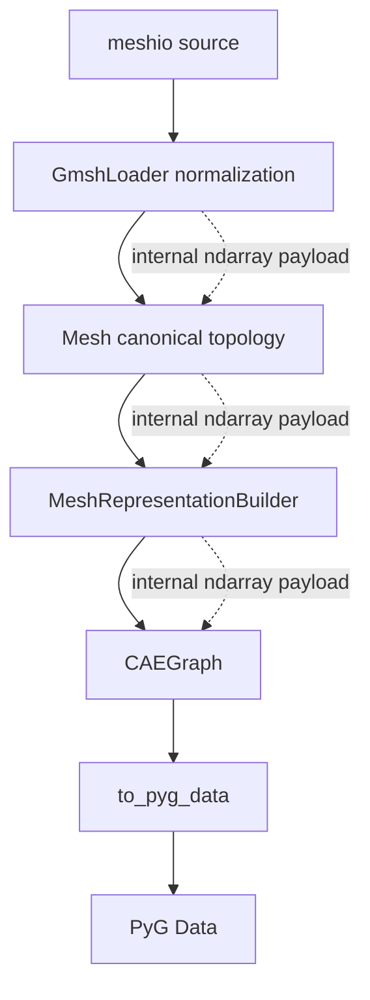

# ADR-025: NumPy-first internal data path

- 编号：ADR-025
- 标题：冻结「NumPy-first 是内部数值表示策略、而非 public API 策略」的表示边界——高容量 numerical / index payload 在实现内部保持 NumPy-native，领域语义对象维持 Python semantic shell，一切 public contract 不变
- 日期：2026-10-10
- 状态：**Proposed（2026-10-10 起草落盘，待 PM / Architecture review 裁决；未采纳前不冻结架构——见 `ARCHITECTURE.md` §7 ADR status semantics）**
- 关联：ADR-012（loader 管线，compatible）、ADR-013（meshio 引擎，compatible）、ADR-014（canonical topology 语义，compatible）、ADR-015/016（表示层级与构造边界，compatible）、ADR-017（backend 适配边界，unaffected）、ADR-019（relation 语义，compatible）、ADR-020/021（`FieldData` / association，unaffected）、ADR-022（PyG backend 契约，compatible）、ADR-023/024（temporal / projection，unaffected）；证据归档（非规范）：`architecture/perf/P2-PERF-01a-evidence.md`、`architecture/perf/P2-PERF-02-reassessment.md`、`tests/e2e/FIRST_E2E_EVIDENCE.md`。编号说明：`P2-PERF-02-reassessment.md` 曾以「ADR-025」散文式指代 02b（public ndarray contract）的假想未来 ADR；本 ADR 按模板取号规则（现有最大编号 + 1）将 ADR-025 用于 internal data path，与 02b 无关，02b 继续 HOLD。

## 心智模型（Mental model）

实线为既有对象链与架构边界（不变）；虚线为高容量 payload 的内部数值承载通道（本 ADR 的政策对象），不出现在任何 public contract 中。

## 背景（Context）

- FACT-01：Gate 5 已 CLOSED，First E2E smoke run 已执行并归档；PM 于该 checkpoint 裁决 `GO P2-PERF-02a — internal, non-BREAKING, memory-bounded`；02b（public ndarray contract）保持 HOLD；Gate 6 未开启。
- FACT-02：实际数据链为 `meshio → GmshLoader normalization → Mesh → MeshRepresentationBuilder → CAEGraph → to_pyg_data`。链路上存在系统性的 `ndarray → tuple/list/Python int → ndarray` 表示往返：`GmshLoader._normalize_source` 将 `_SourceBlock.connectivity` 一次性标量化为 tuple-of-tuples，ndarray 版随即被丢弃；`AbstractMeshLoader._build_topology` 在 Python dict / list / frozenset 容器上完成候选 facet 与 facet 邻接构建；`Mesh` 构造期再从这些 Python 容器重建 canonical int64 CSR 并做 canonical facet 化；`MeshRepresentationBuilder._expand_edges` 逐 cell `.tolist()` 后以 set of tuple 生成 canonical 关系；`CAEGraph._edges` 以 tuple-of-tuples 存储，`CAEGraph.validate` 每次调用对全量边表重排去重重算；`to_pyg_data` 再将 tuple 重建为 ndarray 后转 tensor。其中相当部分转换不承载任何领域语义。
- FACT-03：Reassessment cProfile 归因（tottime self-time 分桶，无嵌套累计）：canonical construction aggregate self-time bucket 占 49.4%（`AbstractMeshLoader._build_topology` 为该桶中主要已识别热点），normalization aggregate self-time 占 11.5%（`GmshLoader._normalize_source` 的连接性转换等），两者合计直接可归属约 60.9%；另有 18.2% 的 builtins / runtime 成本缺 per-caller 证据，作未强归属成本单列。N1 实验：`MeshRepresentationBuilder._expand_edges` 向量化取得 4.3–10.1× 局部加速，但全量候选物化使 peak memory 由 69 MB 升至 331 MB。First E2E 证明 `validate` 与 `to_pyg_data` 当前非瓶颈。
- FACT-04：既有规范已记录 `CAEGraph` 边不变量重查为 O(E log E) 的已知成本（`ARCHITECTURE.md` §3.4 验证分层成本注记），与本 ADR 的观察一致。

## 范围（Scope）

**NumPy numerical substrate**——本政策适用的高容量 numerical / index payload：coordinates、connectivity、entity IDs、offsets、physical tags、group-member IDs、adjacency（含 `facet_cells` 的数值 payload）、canonical pairs、large masks / index arrays、numerical field values。`FieldData.values` 的契约仍为 ADR-020 的 backend-agnostic `Any`，本政策不改变该契约、不追溯数组化既有用户数据。

**Python semantic shell**——继续由 Python domain objects 表达的低基数领域词汇：`Field`、`BoundaryRegion` / `BoundarySpec` / `BoundaryType`、`CellType` 语义定义、`Registry`、Conditions、metadata names / keys、source-format 语义描述符、`NodeCategory`、`Snapshot` 标识字段。

本 ADR 不得读作「所有对象 NumPy 化」。

## 问题（Issues）

- ISSUE-01：FACT-02 所列表示往返中不承载领域语义的部分是自有性能成本的直接主体（FACT-03 的 60.9% 直接可归属归因），且随规模增长。
- ISSUE-02：`CAEGraph` 构造期对已 canonical 输入的防御性二次规范化与 `CAEGraph.validate` 的全量重排去重重算（FACT-04），属于表示成本而非语义要求。
- ISSUE-03：迁移存在耦合——`AbstractMeshLoader._build_topology` 当前消费 `_SourceBlock.connectivity` 的 Python tuple 容器，就地矢量化需先从 Python 容器重建 ndarray，恰复制 ISSUE-01 的往返；消除它涉及 `GmshLoader` normalization 的内部表示。该耦合的处置见迁移策略，不属本 ADR normative 范围。

## 决策（Decision）

- D-01：**NumPy-first is an internal numerical representation policy, not a public API policy.** NumPy-native 只描述实现内部的数值承载方式；性能动机不构成修改任何 public contract 的理由。
- D-02：**Python semantic shell + NumPy numerical substrate.** 高容量 numerical / index payload（范围节 substrate 清单）在实现内部保持 NumPy-native，避免无语义价值的 `ndarray → tuple/list/Python int → ndarray` 往返；领域语义对象维持 Python domain objects（范围节 shell 清单）。`facet_cells` 的数值 payload 原则上可纳入 substrate，但 `Mesh` internal storage 是否迁移 ndarray / CSR 表示不由本 ADR 自动授权，仅登记于迁移策略与 Open Questions。
- D-03：Internal ndarray representation ≠ public ndarray contract。下列既有语义原则全部保持不变：public API 与 return types、`CAEGraph.edges` 当前 contract、canonical IDs 与 deterministic ordering、`CellType` local-node semantics、`Mesh` topology semantics、facet / `facet_cells` 语义、field association、`BoundaryRegion` 语义、ADR-019 relation semantics、ADR-022 backend keys、`core` / `geometry` / `io` 不依赖 PyG、loader / builder / adapter 架构边界。public ndarray contract 属 02b，继续 HOLD；任何候选方案要求修改 accepted semantic contract 时必须停止并交 PM，不得自行 supersede。
- D-04：**NumPy-first ≠ full-materialization-first.** 矢量化方案必须同时评估 wall time 与 peak memory；chunked / streaming 是合法且优先考虑的策略；不默认物化全量 candidate arrays；算法选型必须同时论证时间与内存 scaling（N1 的 69 MB → 331 MB 为反例证据）。具体 benchmark 分档与阈值属 02a implementation acceptance policy，不进入本 ADR。
- D-05：任何 internal representation change 都必须保持 canonical semantics，等价性由 characterization oracle 证明——修改前 old implementation == reference oracle，修改后 new implementation == same oracle，不要求人为 red-before-green。oracle 锚定 ADR-014 topology 事实与 ADR-019 relation 语义（canonical `(min, max)` 去重、退化对丢弃、deterministic ordering）。

## 迁移策略（Migration Strategy — non-normative, advisory）

本节不构成 normative Decision，迁移切分由 PM review 后裁决；当前不存在 `feature/perf-02a*` 在途分支，无既有实现 scope 需要保护。

- 切法一（PM 已裁决的默认映射）：02a-1 `AbstractMeshLoader._build_topology`（P0）→ 02a-2 `MeshRepresentationBuilder._expand_edges` → re-profile → 02a-3 `GmshLoader` normalization 连接性转换（仅 re-profile 后仍显著时授权）。
- 切法二（Source → Mesh 统一 NumPy-native 批）：normalization 与 topology construction 合批。代码级事实：`_build_topology` 消费 `_SourceBlock.connectivity` 的 Python tuple（ISSUE-03），单独矢量化 02a-1 必须先从 Python 容器重建 ndarray，复制被禁往返。统一批收益是转换总成本更低、往返消除更彻底；代价是单批改动面与 oracle 覆盖面更大，且偏离已裁决批次顺序。
- 02a-1 实现中若证明「不改变 `GmshLoader` normalization 表示即无法合理完成」，按流程记录 coupling microdecision 并 STOP 交 PM。

## 兼容性核实

| ADR | 结论 | 说明 |
| --- | --- | --- |
| ADR-012 | compatible | 五步 loader 管线与 validate 契约不变；步骤②③的内部表示可变 |
| ADR-013 | compatible | meshio provisional 引擎、lazy import 与类型不泄漏边界不变 |
| ADR-014 | compatible | CSR 单一事实源、winding-free canonical facet、`facet_cells` 语义不变 |
| ADR-015 | compatible | 表示层级与 source-type 子类禁令不变 |
| ADR-016 | compatible | 构造边界与「API / naming 不冻结」状态不变 |
| ADR-017 | unaffected | backend 适配边界与 `to_pyg_data` 不在 02a 范围 |
| ADR-019 | compatible | relation 语义不变，等价性由 D-05 oracle 保证 |
| ADR-020 / 021 | unaffected | `FieldData.values` 契约（`Any`）与 association family 不变 |
| ADR-022 | compatible | PyG schema、fail-fast 与 by-value 语义不变 |
| ADR-023 / 024 | unaffected | temporal / projection 语义不依赖内部容器形态 |

结论：无 accepted-ADR conflict。

## 本 ADR 不覆盖项（Non-goals）

02b（public ndarray contract）；Gate 6；meshio 引擎替换（触发条件见 ADR-013）；`CAEGraph` 内部数值存储（D 区）迁移；`Mesh` internal storage（含 `facet_cells` CSR 化）迁移；具体 benchmark 分档与阈值数字；perf evidence 归档原文的任何修订。

## 备选方案（Options considered）

| 方案 | 结论 | 原因 |
| --- | --- | --- |
| 保持 Python-container numerical path | 否决 | FACT-03 的自有成本归因与已裁决 GO 02a 矛盾；往返成本随规模增长 |
| 仅做零散 hotspot patch | 否决 | 不消除 ndarray ↔ Python 往返的系统性根因，且无统一表示边界纪律 |
| 所有 domain objects ndarray 化 | 否决 | 摧毁 semantic shell；低基数领域词汇不是数组语义，违背 D-02 |
| 直接把 public API 改为 ndarray | 否决 | 即 02b：HOLD、原则上 BREAKING、独立决策，与 D-01 / D-03 冲突 |
| full-materialization vectorization | 否决 | N1 的 69 MB → 331 MB 证明无界物化不可接受，与 D-04 冲突 |

## 影响（Consequences）

正面：以单一政策消除无语义表示往返的系统性根因，为 02a-1 / 02a-2 / 02a-3 及后续性能工作提供统一边界依据，降低每个 gate 后的表示争议成本。代价：矢量化实现的复杂度与可读性成本，oracle 需与实现同步维护，迁移过渡期两类内部表示并存，`io` / `graph` 层对 NumPy 的依赖加深（NumPy 非 PyG，`core` / `geometry` / `io` 永不 import PyG 的边界不变）。后续必须做的事：每个实现批次按 D-05 建立 oracle 并留存证据，批次后 re-profile，迁移切分由 PM 裁决。

## Invariant 登记策略

本 ADR 为原则 / 政策类 ADR，按 architecture SKILL 不创建 `ADR-025-invariants.yaml`。D-05 的 oracle 等价要求属实现验收纪律，随 02a 实现批次的测试落地，届时如适用再按 TEST_MISSING → evidence 流程登记到对应实现型登记。

## Evidence

`architecture/perf/P2-PERF-01a-evidence.md`（N1：向量化收益与物化内存代价）、`architecture/perf/P2-PERF-02-reassessment.md`（First E2E / N1 / cProfile 三组证据与 GO 02a 裁决记录）、`tests/e2e/FIRST_E2E_EVIDENCE.md`（全链行为基线）。三者为 evidence archive，不是 ADR、不构成规范。Evidence 回答「测到了什么」；本 ADR 只回答「因此决定什么」。

## Re-trigger conditions

Gate 6 扩张或下游开始依赖具体容器表示时，重新评估迁移窗口并从届时 latest main + E2E / workload 证据起草 02b 的独立 ADR；meshio 引擎替换触发（ADR-013 决策 6）时重新核对 substrate 边界；02a-1 / 02a-2 落地并 re-profile 后，重新评估 D 区（`CAEGraph` 内部数值存储）是否需要独立决策。

## Open Questions

① ISSUE-03 的 coupling microdecision：02a-1 是否必须（或应当）连同 `GmshLoader` normalization 表示一起变更；② `Mesh` internal storage（含 `facet_cells`）是否迁移 ndarray / CSR 表示；③ D 区候选（`CAEGraph.validate` 全量重算、`CAEGraph._edges` 内部表示、构造期防御性二次规范化）；④ `architecture/design/class_diagram.puml` 标题的 ADR 范围硬编码与 `architecture/UML_GUIDE.md` §5 的 ADR 清单，待本 ADR accepted 轮一并同步。

## 修订历史（Revision history）

- 2026-10-10 v1：proposed——起草落盘，待 PM / Architecture review 裁决；状态值 `Proposed` 为 PM 派单的显式指定。
