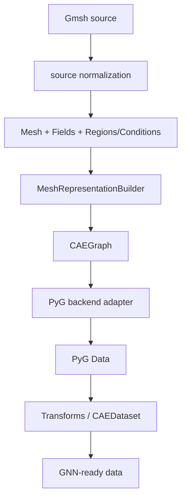

# Phase 2 — CAE Data Pipeline

Status: In progress — ADR-015~024 accepted; coding gates 1–5 landed (1 domain core, 2 Field/semantic regions, 3 topology subsystem, 4a representation construction with the node-graph builder per ADR-019, 4b backend adaptation per the ADR-022 PyG backend representation contract on the post-split, projection-capable model, 5 source IO vertical slice per ADR-012/013/014 — `AbstractMeshLoader` + gmsh adapter + format registry on the core registry), plus the ADR-020 field split (Field declaration / `FieldData` realization, builder-only write path), the ADR-021 association-family contract, the ADR-023 temporal organization (Dispatch ① `Snapshot` / `register_snapshot`) and the ADR-024 single-state projection (Dispatch ② `CAEGraph.project_snapshot`); after gate 5 closure the **First E2E smoke run** was executed and archived (`tests/e2e/FIRST_E2E_EVIDENCE.md`) and PM ruled **GO P2-PERF-02a**; next: the **P2-PERF-02a NumPy-first restructuring interlude** (see the Coding gate list), then 6 transforms/dataset/write-back, 7 end-to-end validation + benchmark. Completion is defined by the Definition of Done below, not by module completeness.

Goal: implement **R1** — the CAE → GNN data band (ADR-007/008): the domain-core objects plus geometry / io / graph / transforms / dataset.

## Definition of Done

Phase 2 is complete when the first real data path is closed end to end — not when every planned module exists. A representative cell-based CAE case must flow through the full pipeline:



Topology, field association and region/boundary semantics must survive every conversion boundary without unintended loss or alteration. Gates 5–7 exist to serve this contract; module completeness alone does not close the phase.

## New modules (planned)

The tree below reflects the ADR-015 representation hierarchy; the already-landed `core/celltype.py` has migrated into `core/topology/` (ADR-015 accepted).

```
src/caegraph/core/          # domain canonical representation (ADR-015)
├── caegraph.py             # CAEGraph: graph-native canonical domain
│                           #   representation (ADR-015); semantic composition
│                           #   (ADR-018): entities, relations, geometry, fields,
│                           #   regions, conditions; topology subsystem =
│                           #   optional semantic provider, not class members;
│                           #   never imports PyG
├── field.py                # Field: stable physical quantity declaration +
│                           #   FieldData: one realization (values, timestep
│                           #   + metadata) — declaration/realization split
│                           #   per ADR-020; builder is the only FieldData
│                           #   write path
├── boundary/               # semantic-region vocabulary (annotates CAEGraph)
│   ├── region.py           # BoundaryRegion: named semantic region (ADR-018) —
│   │                       #   membership per source discretization (cell-based:
│   │                       #   codim-1 facet region; exterior boundary /
│   │                       #   internal interface)
│   ├── manager.py          # BoundaryManager: semantic naming registry + spec
│   │                       #   binding resolution; topology ownership stays in
│   │                       #   the topology subsystem (references only)
│   └── spec.py             # BoundarySpec (slot-coherence validation, ADR-011);
│                           #   function.py (FieldFunction) deferred to the
│                           #   BC-declaration slice
└── topology/               # topology subsystem (ADR-014 narrowed; first-class
    ├── celltype.py         #   for cell-based discretizations) — CellType:
    │                       #   explicit stable integer codes, dim/node_count,
    │                       #   CAEGraph local-node convention + codim-1 face
    │                       #   templates (migrates from core/celltype.py)
    └── mesh.py             # Mesh: topology-rich discretization representation —
                            #   the cell-based topology representation supported
                            #   by the topology subsystem (FEM/FVM); nodes (n,3),
                            #   cells CSR, explicit facets CSR + facet_cells,
                            #   domain groups; canonical global IDs — backend
                            #   block indices never escape io normalization

src/caegraph/geometry/
├── metrics.py              # mesh-derived geometric entity features:
│                           #   distance/direction/normal/quality
└── interpolation.py        # explicit field interpolation onto mesh nodes
                            #   (e.g. cell field → node field): a data
                            #   transform, never an implicit side effect of
                            #   loading, building or backend adaptation

src/caegraph/io/
├── base.py                 # AbstractMeshLoader: stable __call__ pipeline
│                           #   (ADR-012); the loader abstraction for mesh-based
│                           #   source representations, not the universal source
│                           #   abstraction of CAEGraph; protected hooks are
│                           #   adapter implementation details, not frozen
├── registry.py             # format registry on the core registry
├── gmsh.py                 # first source adapter: normalizes the Gmsh source
│                           #   representation through meshio (external IO
│                           #   engine, ADR-013) into the canonical Mesh
└── vtk_writer.py           # write-back into the ParaView ecosystem

src/caegraph/graph/         # representation construction + backend adapter layer;
│                           #   two logically separate concerns — construction
│                           #   (ADR-016) and adaptation (ADR-017); the layer
│                           #   must never be imported by core (no core → graph)
├── builder.py              # representation builder (extension point, ADR-015):
│                           #   source discretization → CAEGraph entities +
│                           #   relations; construction boundary: ADR-016
│                           #   (accepted; API/registry/layout not frozen)
└── pyg.py                  # backend adapter: CAEGraph → framework-specific
                            #   representation, concretized as
                            #   torch_geometric.data.Data in Phase 2
                            #   (adaptation contract: ADR-017; PyG is a
                            #   backend, never the domain model)

src/caegraph/transforms/    # backend-consumable encoding of geometry, features
│                           #   and physics/boundary semantics; enforcement
│                           #   strategy stays model-side (not prescribed here,
│                           #   and never by mutating Graph)
├── geometry.py             # coordinate / feature normalization
├── feature.py              # CAE feature engineering
└── physics.py              # boundary/physics semantic encoding into
                            #   backend-consumable features, masks and
                            #   attributes; does not prescribe model-side
                            #   enforcement strategy

src/caegraph/dataset/
└── dataset.py              # CAEDataset(PyG Dataset): collections, splits
```

## Planned public APIs

- `CAEGraph` — domain canonical representation (ADR-015): semantic composition (ADR-018) of entities, relations, fields, geometry, regions, conditions; topology subsystem = optional semantic provider; never imports PyG
- `Mesh` / `CellType` — topology subsystem (ADR-014 narrowed): Mesh is a topology-rich discretization representation (FEM/FVM), no longer the top-level canonical object
- `Field` / `FieldData` / `BoundaryRegion` / `BoundarySpec` / `BoundaryManager` — field & semantic-region vocabulary: `Field` is the stable physical-quantity declaration (single authoritative semantics source), `FieldData` one realization (values + realization metadata, ADR-020; ADR-007 D6 signature superseded, ADR-010/011 for the boundary vocabulary); `FieldFunction` deferred
- `AbstractMeshLoader` + gmsh adapter — source loading pipeline (ADR-012; target object redefined by ADR-015); meshio provisional engine (ADR-013)
- representation builder — source discretization → CAEGraph entities + relations; extension point per ADR-015, construction boundary frozen by ADR-016 (accepted; API/naming/registry deferred to the coding dispatch); replaces the single `Mesh → GraphBuilder` contract. The Phase 2 learning representation is a node graph — node entities are the graph vertices (ADR-019); cell identities are retained because CAE source data may be cell-associated, not because Phase 2 intends a heterogeneous or cell-centered GNN graph
- backend adapter — `CAEGraph → framework-specific representation` (PyG Data in Phase 2; adaptation boundary frozen by ADR-017, accepted — DataGraph is the conceptual backend representation layer, backend-side, owns no domain semantics, not a domain class). Boundary with construction: the representation builder decides the canonical domain structure — graph vertices are node entities, relations are canonical node pairs — while the adapter only materializes that representation into the backend (`edge_index`, tensors, masks, attributes); `pyg.py` contains the PyG backend adapter, does not reimplement PyG graph abstractions and never re-decides what a node is or how cells connect (it is not a second GraphBuilder)
- Semantic-preservation principle (backend adaptation): adaptation preserves semantics and must not silently perform domain-changing transformations. Symmetric directed `edge_index` expansion of the canonical undirected pairs is adaptation (backend side per ADR-019 D3); turning a cell field into a node field by interpolation is not — that is an explicit data/representation transform (geometry band), never something a loader, builder or backend adapter does implicitly
- Geometry / feature / physics transforms (PyG transform protocol)
- `CAEDataset`; VTK writer

## Validation focus (Validation Agent, mandatory)

Validation verifies **information preservation across representation boundaries** — not just matching node/edge counts. Organized by conversion boundary:

- **Source → canonical topology/domain data**
  - source ordering normalization; cell/facet topology facts per ADR-014
  - source named group mapping (e.g. Gmsh physical groups) → domain groups / BoundaryRegion (global facet IDs — cell-based scope per ADR-014), classified by dimension per ADR-012
  - field association recorded with its entity scope
- **Canonical data → CAEGraph**
  - entity identity: node/cell entity families per ADR-019 D1; `n_entities` is the node-graph vertex count, never `n_nodes + n_cells`
  - canonical relations: deduplicated `(min, max)` node pairs with degenerate `(a, a)` candidates discarded during expansion; 1D LINE2 cells contribute their own node pair
  - region semantics and NodeCategory: interior / boundary / corner, derived only from boundary-participation regions, counted by distinct region membership (not facet occurrences); 1D meshes → always INTERIOR; interface / physical-group participation is not covered by the current mapping (dedicated ADR triggers recorded in ADR-019 D4)
  - FieldData cardinality: leading entity axis of exactly `n_nodes` / `n_cells` entries for node/cell associations (ADR-019 D5 as amended by ADR-020 D5, validated by the representation builder — the only FieldData write path); declaration-only field sets are legal (ADR-020 D4)
  - ADR-019 invariants: machine-auditable checklist (`ADR-019-invariants.yaml`) — each executable invariant mapped to guarding tests; `TEST_MISSING` marks explicitly registered items that have no independent executable surface yet (e.g. the D1-01 architecture-level scope declaration) and must never be silently dropped
- **CAEGraph → PyG (backend adaptation)**
  - graph vertex preservation: adapter `num_nodes` equals `graph.n_entities`
  - canonical relation → backend `edge_index`: symmetric directed materialization `[2, 2E]` while CAEGraph storage stays undirected with no duplicated bidirectional entries (ADR-019 D3 / ADR-017)
  - `graph.validate()` enforced at the adaptation entry; field/geometry mapping and boundary encoding present with dtype/association preserved
  - no unintended domain-semantic transformation (semantic-preservation principle — e.g. no silent cell→node interpolation)
- **Output / round trip**
  - VTK validation: canonical Mesh → VTK → re-read topology consistency; Phase 2 owns the Mesh→VTK writer (Graph-layer predicted-field export stays with Phase 4)
  - end-to-end representative Gmsh pipeline per the Definition of Done
- PyG boundary: `core`/`geometry`/`io` never import `torch_geometric`

## Rules

- Loaders register via the core registry; no loader hard-imports another.
- Synthetic meshes only in tests (Testing Skill CAE rules).
- Real solver formats (Fluent, Abaqus, OpenFOAM…) enter here — each new format is a feature request routed through PM (Architecture review first).
- Registry stays a name→factory mapping (Phase 1 contract: callable check only — Python type erasure makes runtime generic checks a non-goal). Runtime type enforcement (`Registry(kind, base_class=...)` + `issubclass`) is a recorded future option (Design UML Registry note); adopt it only if Phase 2 loader wiring needs it, decided explicitly.
- Loading and topology structure follow ADR-012 (source normalization → topology input per ADR-014; the product feeds CAEGraph construction, ADR-015/016) and ADR-014 (canonical cell-based topology model); meshio is the provisional IO engine (ADR-013).
- Resolved design question (ADR-011): the ADR-010 "未来演进" re-evaluation is complete — keep the single seven-value `BoundaryType` through Phase 2. `BoundarySpec` must enforce per-type slot-coherence validation (`paired_region` required for PERIODIC; value slots meaningful only for constraint-valued types); refined Phase 3 re-trigger conditions for a possible orthogonal role × constraint split are recorded in ADR-011.

## Coding gate

Coding order follows the ADR-015 hierarchy — CAEGraph core first, topology/discretization adapters after. Gate numbers are referenced by the Status line and the review records:

1. **Domain core** — `CAEGraph` semantic composition (entities, relations, fields, regions, conditions; never PyG) — *landed*
2. **Field / semantic regions** — `Field` / `boundary/` vocabulary — *landed*
3. **Topology subsystem** — FEM: Mesh topology + CellType (CellType foundation landed in Phase 1, migrated per ADR-015) — *landed*
4. **Representation construction + backend adaptation** — two adjacent but distinct conversion boundaries (construction is not the prelude of adaptation, ADR-016 vs ADR-017):
   - **4a. Representation construction** — `MeshRepresentationBuilder`, node-graph construction per ADR-019 — *landed*
   - **4b. Backend adaptation** — PyG Data as the Phase 2 framework representation (ADR-017) — *landed*. ADR-019 executable invariants relevant to backend adaptation must be guarded before this gate closes; D1-01 remains an explicitly registered architecture-level scope invariant (`TEST_MISSING`) unless a non-artificial executable surface emerges — the invariant registry serves the architecture, never the reverse
5. **Source IO vertical slice** — `AbstractMeshLoader` + gmsh adapter; format registry on the core registry (ADR-012/013) — *landed / CLOSED* (B0 VERIFIED; B1 CLOSED; B2 merged `3182ee0`; B3 validation + generated UML + documentation completed, landed via `d11ff6d`; B4 independent review APPROVED — the approval authorized the B3 landing); followed by the First E2E smoke run — a post-closure system-level check, not a gate 5 prerequisite — *executed and archived* (`tests/e2e/FIRST_E2E_EVIDENCE.md`)

**Performance interlude — P2-PERF-02a NumPy-first internal restructuring** — *GO 02a, ruled at the First E2E checkpoint*: internal, non-BREAKING, memory-bounded; batches 02a-1 loader `_build_topology` (P0) → 02a-2 builder `_expand_edges` → 02a-3 conditional. Details, constraints and evidence: `architecture/perf/P2-PERF-02-reassessment.md`

6. **Transforms / dataset / write-back** — geometry/feature/physics transforms, `CAEDataset`, VTK writer
7. **End-to-end validation + benchmark** — the first full Gmsh → GNN-ready pipeline per the Definition of Done; R1 proven as a whole

CellType prerequisites remain binding for any topology work: stable integer codes (explicit mapping, not enum-declaration order), CAEGraph local-node conventions, codim-1 face templates — frozen with the implementation (docstring + tests).

## Depends on

Phase 1 (core vocabulary: BaseObject, registry, enums).

## Backlog

- [ ] doctest 常驻化：pytest --doctest-modules 全库启用评估（owner: Testing；触发：下个测试配置变更或 phase 收尾；基线：B2 修复后 10/10 人工验证）
- [ ] 校验精准触发（on_metadata_changed 覆写）：按依赖准则定向重跑 metadata 与 cross 层（owner: Architecture/Coding；触发：首个赋予 metadata 键领域语义的子类出现，或大图高频 metadata 更新；基线：BaseObject 默认全量校验 + 原子回滚已落地，CAEGraph 显式声明无标注约束与交叉约束）
