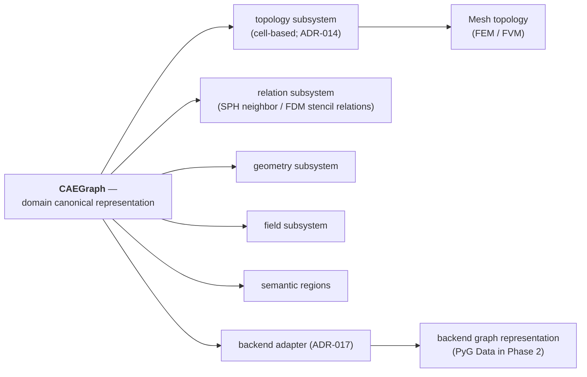

# Architecture Overview

This page summarizes the architecture; the binding specification lives in [`architecture/ARCHITECTURE.md`](https://github.com/XYChouMian/caegraph/blob/main/architecture/ARCHITECTURE.md).

## Design philosophy

- Modular design — one responsibility per subpackage
- Reusable components — small, composable building blocks
- Clear abstraction — documented, reviewed abstractions only
- API stability — documented APIs are contracts
- Documentation consistency — docs generated from code

## Package map

| Package | Responsibility | Depends on |
| --- | --- | --- |
| `caegraph.core` | domain truth: BaseObject, CAEGraph (canonical domain representation), topology subsystem (Mesh, cell-based), Field; boundary vocabulary, registries, shared enums | — |
| `caegraph.geometry` | geometric services: metrics, edge features, interpolation | core |
| `caegraph.io` | loaders (gmsh first) and writers (VTK); format registry | core |
| `caegraph.graph` | representation construction (source discretization → CAEGraph; construction contract in ADR-016) + backend adapter (CAEGraph → framework representation; PyG Data in Phase 2; ADR-017) | core, geometry |
| `caegraph.transforms` | geometry / feature / physics transforms (BC encoding) on PyG Data | graph |
| `caegraph.dataset` | CAEDataset: collections, splits (backend-specific; PyG Dataset in Phase 2) | graph, transforms |
| `caegraph.physics` | PDE residuals, physics losses, constraints | core, graph |
| `caegraph.models` | Model interface + CAE model utilities (no GNN zoo) | core, graph, physics |
| `caegraph.assimilation` | observation / correction operators (data assimilation) | core, graph, physics |
| `caegraph.workflow` | training utilities: loss assembly, CAE batch adaptation (no fit loop) | physics, models, assimilation, dataset |
| `caegraph.inference` | neural-simulation harness: simulator, rollout loop (numerics model-side) | core, graph, transforms, models, assimilation, io |
| `caegraph.visualization` | discretization/field/graph plotting | core, graph, io |
| `caegraph.utils` | logging and reproducibility helpers | — |

Representation construction belongs to `caegraph.graph`: representation builders map any source discretization (mesh / grid / particles) onto a CAEGraph (ADR-015); construction boundaries are defined in ADR-016 (accepted). CAEGraph → framework representation (PyG Data in Phase 2) conversion belongs to the backend adapter (adaptation boundary in ADR-017, accepted — DataGraph is a conceptual backend representation layer, not a required class); `Graph` is not a domain class, and CAEGraph has no source-type subclasses. The topology subsystem (`Mesh`) offers no `to_graph()`, and core never imports graph; `CAEDataset` and `Model` remain backend-specific — PyG Dataset and torch.nn.Module are the current Phase 2 implementation choices, not a frozen contract (ADR-009, as amended by ADR-015).

## Representation hierarchy

Hierarchy semantics: CAEGraph is the single domain canonical representation; the composition of its semantic subsystems depends on the source discretization — the topology subsystem is first-class for cell-based methods and absent for mesh-free ones, where generated adjacency relations take its place. **Subsystem relationships describe semantic composition, not Python inheritance.** Construction contracts live in ADR-016, backend adaptation in ADR-017 (ADR-015).

## UML dual system

- **Design UML** (`architecture/design/`) — the planned design.
- **Generated UML** (`diagrams/generated/`) — the real state of the code.

See the [UML guide](https://github.com/XYChouMian/caegraph/blob/main/architecture/UML_GUIDE.md).
