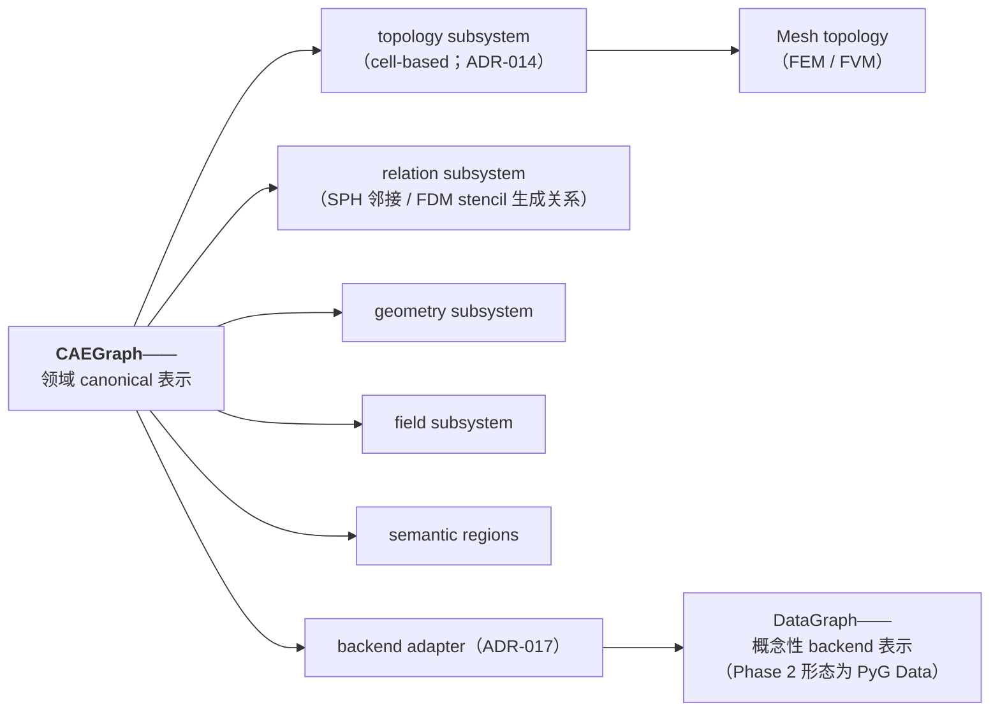

# 架构总览

本页是架构摘要；具有约束力的规范见 [`architecture/ARCHITECTURE.md`](https://github.com/XYChouMian/caegraph/blob/main/architecture/ARCHITECTURE.md)。

## 设计哲学

- 模块化设计——每个子包只承担一个职责
- 可复用组件——小而可组合的构建块
- 清晰抽象——只保留有文档、经过评审的抽象
- API 稳定性——已文档化的 API 即为契约
- 文档一致性——文档从代码生成

## 包地图

| 包 | 职责 | 依赖 |
| --- | --- | --- |
| `caegraph.core` | 工程真源：BaseObject、CAEGraph（canonical 领域表示）、topology subsystem（Mesh，cell-based）、Field；边界词汇、注册机制、共享枚举 | — |
| `caegraph.geometry` | 几何服务：度量、边特征、插值 | core |
| `caegraph.io` | 加载器（gmsh 首发）与写回（VTK）；格式注册表 | core |
| `caegraph.graph` | 表示构造（source discretization → CAEGraph；构造契约见 ADR-016）+ backend adapter（CAEGraph → 框架侧表示；Phase 2 形态为 PyG Data；ADR-017） | core, geometry |
| `caegraph.transforms` | 几何/特征/物理变换（边界条件编码），作用于 PyG Data | graph |
| `caegraph.dataset` | CAEDataset：集合、切分（后端特定；Phase 2 采用 PyG Dataset） | graph, transforms |
| `caegraph.physics` | PDE 残差、物理损失、约束 | core, graph |
| `caegraph.models` | Model 接口 + CAE 模型公用设施（无 GNN zoo） | core, graph, physics |
| `caegraph.assimilation` | 观测/修正算子（实验数据同化） | core, graph, physics |
| `caegraph.workflow` | 训练公用设施：loss 组装、CAE 批处理适配（无 fit 循环） | physics, models, assimilation, dataset |
| `caegraph.inference` | 神经仿真壳：simulator、rollout 循环（数值格式在模型侧） | core, graph, transforms, models, assimilation, io |
| `caegraph.visualization` | 离散表示/场/图可视化 | core, graph, io |
| `caegraph.utils` | 日志与可复现性工具 | — |

表示构造由 `caegraph.graph` 的 representation builder 负责：任意 source discretization（mesh / grid / particles）→ CAEGraph（ADR-015）；构造契约见 ADR-016（proposed）。CAEGraph → 框架侧表示（Phase 2 形态为 PyG Data）由 backend adapter 完成（适配契约见 ADR-017，proposed；DataGraph 是概念性的 backend 表示层，非必须实现类），"Graph" 不是领域类，CAEGraph 也无 source-type 子类。topology subsystem（Mesh）不提供 `to_graph()`，core 永不 import graph；`CAEDataset` 与 `Model` 保持后端特定——PyG Dataset 与 torch.nn.Module 是 Phase 2 的实现选择，并非冻结契约（ADR-009，经 ADR-015 修订）。

## 表示层级

层级语义：CAEGraph 是唯一的领域 canonical 表示，各语义子系统的组成取决于源离散——cell-based 方法下 topology 一等，mesh-free 方法下由生成邻接关系顶替；构造契约见 ADR-016，backend 适配契约见 ADR-017（ADR-015）。

## UML 双体系

- **Design UML**（`architecture/design/`）——计划中的设计。
- **Generated UML**（`diagrams/generated/`）——代码的真实状态。

详见 [UML 指南](https://github.com/XYChouMian/caegraph/blob/main/architecture/UML_GUIDE.md)。
