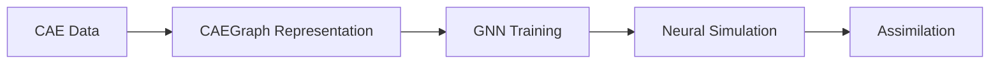

# CAEGraph

**A workflow framework bridging CAE simulation and Physics AI.**

CAEGraph normalizes heterogeneous CAE data into the graph-native canonical domain representation **CAEGraph** and reaches PyTorch Geometric through a backend adapter, supporting GNN training for engineering problems, neural simulation across different discretizations, and experimental-data assimilation.



!!! note "Project status"

    CAEGraph is in **Phase 2 (CAE Data Pipeline)**. The Phase 0 package skeleton, architecture specification, UML system, documentation and CI, plus the Phase 1 core vocabulary (`BaseObject`, registry, shared enums), are complete. The architecture baseline is ADR-015~018 (CAEGraph as the canonical domain representation; topology subsystem, construction, backend-adaptation, and domain-composition contracts). Coding gates 1–3 have landed: the CAEGraph domain core (`CAEGraph`, `Field`, boundary vocabulary) and the topology subsystem (`Mesh`, `CellType`); the data band (loaders, representation builder, backend adapter, transforms, dataset) is in progress; GNN training capabilities remain planned.

## Getting started

```bash
pip install -e .
```

```python
import caegraph
print(caegraph.__version__)
```

## Where to go next

- [Architecture overview](architecture/overview.md)
- [API reference](api/index.md)
- [Tutorials](tutorials/index.md)
- [Examples](examples/index.md)
