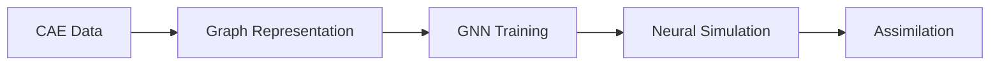

# CAEGraph

**A workflow framework bridging CAE simulation and Physics AI.**

CAEGraph converts framework-independent engineering truth into PyG-native graph representations, supports GNN training for engineering problems, runs neural simulation on new meshes, and assimilates experimental observations.



!!! note "Project status"

    CAEGraph is in **Phase 2 (CAE Data Pipeline)**. The Phase 0 package skeleton, architecture specification, UML system, documentation and CI, plus the Phase 1 core vocabulary (`BaseObject`, registry, shared enums), are complete. `Mesh` / `Field` and the data pipeline are being implemented; GNN training capabilities remain planned.

## Getting started

```bash
pip install -e .
```

```python
import caegraph
print(caegraph.__version__)
```

## Where to go next

- [Architecture overview](architecture/overview.md)
- [API reference](api/index.md)
- [Tutorials](tutorials/index.md)
- [Examples](examples/index.md)
