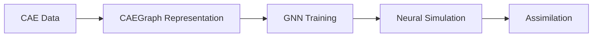

# CAEGraph

**A workflow framework bridging CAE simulation and Physics AI.**

CAEGraph normalizes heterogeneous CAE data into the graph-native canonical domain representation **CAEGraph** and reaches PyTorch Geometric through a backend adapter, supporting GNN training for engineering problems, neural simulation across different discretizations, and experimental-data assimilation.


```mermaid
flowchart LR
    A[CAE Data] --> B[CAEGraph Representation] --> C[GNN Training] --> D[Neural Simulation] --> E[Assimilation]
    classDef nowrap white-space:nowrap
    class A,B,C,D,E nowrap
```

!!! note "Project status"

    CAEGraph is in **Phase 2 (CAE Data Pipeline)**. The Phase 0 package skeleton, architecture specification, UML system, documentation and CI, plus the Phase 1 core vocabulary (`BaseObject`, registry, shared enums), are complete. The architecture baseline is ADR-015~024 (CAEGraph as the canonical domain representation; topology subsystem, construction, backend-adaptation, domain-composition, entity/relation model, field declaration/realization and association-family contracts, the PyG backend representation contract, and the snapshot temporal organization with single-state projection). Coding gates 1–4b have landed: the CAEGraph domain core (`CAEGraph`, `Field`/`FieldData`, boundary vocabulary), the topology subsystem (`Mesh`, `CellType`), node-graph construction with NodeCategory derivation, and the PyG backend adapter (`caegraph.graph.to_pyg_data`, ADR-022); plus the ADR-020 field split, the ADR-021 association-family contract, the ADR-023 snapshot temporal organization (Dispatch ①: `Snapshot`, `CAEGraph.register_snapshot`) and the ADR-024 single-state projection (Dispatch ②: `CAEGraph.project_snapshot`). Gate 5 source IO is **CLOSED** (`caegraph.io`: the `AbstractMeshLoader` five-step source-normalization pipeline, the meshio-backed `GmshLoader`, `FORMAT_REGISTRY`): Batch 0 — VERIFIED; Batch 1 — CLOSED; Batch 2 — Source IO merged (`3182ee0`); Batch 3 — Validation / Generated UML / Documentation completed, landed via `d11ff6d`; Batch 4 — Independent Review APPROVED (the approval authorized the Batch 3 landing). **Next milestone: First E2E validation** (Gmsh → GmshLoader → Mesh → MeshRepresentationBuilder → CAEGraph → validate() → to_pyg_data → minimal consumer) — a system-level check after gate 5 closure, not a gate 5 prerequisite; the remaining data band (transforms, dataset) is in progress; GNN training capabilities remain planned.

## Getting started

```bash
pip install -e .
```

```python
import caegraph
print(caegraph.__version__)
```

## Where to go next

- [Architecture overview](architecture/overview.md)
- [API reference](api/index.md)
- [Tutorials](tutorials/index.md)
- [Examples](examples/index.md)
