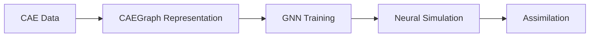

# CAEGraph

**A workflow framework bridging CAE simulation and Physics AI.**

CAEGraph normalizes heterogeneous CAE data into the graph-native canonical domain representation **CAEGraph** and reaches PyTorch Geometric through a backend adapter, supporting GNN training for engineering problems, neural simulation across different discretizations, and experimental-data assimilation.


```mermaid
flowchart LR
    A[CAE Data] --> B[CAEGraph Representation] --> C[GNN Training] --> D[Neural Simulation] --> E[Assimilation]
    classDef nowrap white-space:nowrap
    class A,B,C,D,E nowrap
```

!!! note "Project status"

    CAEGraph is in **Phase 2 (CAE Data Pipeline)**. The Phase 0 package skeleton, architecture specification, UML system, documentation and CI, plus the Phase 1 core vocabulary (`BaseObject`, registry, shared enums), are complete. The architecture baseline is ADR-015~024 (CAEGraph as the canonical domain representation; topology subsystem, construction, backend-adaptation, domain-composition, entity/relation model, field declaration/realization and association-family contracts, the PyG backend representation contract, and the snapshot temporal organization with single-state projection). Coding gates 1–4a have landed: the CAEGraph domain core (`CAEGraph`, `Field`/`FieldData`, boundary vocabulary), the topology subsystem (`Mesh`, `CellType`), node-graph construction with NodeCategory derivation, the snapshot temporal organization (`Snapshot`, `CAEGraph.register_snapshot`) and single-state projection (`CAEGraph.project_snapshot`); the remaining data band (loaders, backend adapter, transforms, dataset) is in progress; GNN training capabilities remain planned.

## Getting started

```bash
pip install -e .
```

```python
import caegraph
print(caegraph.__version__)
```

## Where to go next

- [Architecture overview](architecture/overview.md)
- [API reference](api/index.md)
- [Tutorials](tutorials/index.md)
- [Examples](examples/index.md)
