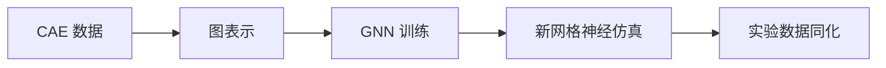

# CAEGraph

**连接 CAE 仿真与 Physics AI 的工作流框架。**

CAEGraph 将工程真源转换为 PyG 原生图表示，支持面向工程问题的 GNN 训练、
新网格神经仿真以及实验数据同化。



!!! note "项目状态"

    CAEGraph 已进入 **Phase 2（CAE 数据管线）**。Phase 0 的包骨架、架构规范、
    UML 体系、文档与 CI，以及 Phase 1 的核心共享词汇（`BaseObject`、注册表、
    共享枚举）均已完成；`Mesh` / `Field` 与数据管线正在实现中，
    GNN 训练能力仍为规划功能。

## 快速开始

```bash
pip install -e .
```

```python
import caegraph
print(caegraph.__version__)
```

## 下一步

- [架构总览](architecture/overview.md)
- [API 参考](api/index.md)
- [教程](tutorials/index.md)
- [示例](examples/index.md)
