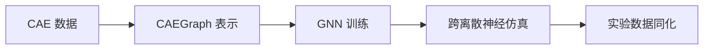

# CAEGraph

**连接 CAE 仿真与 Physics AI 的工作流框架。**

CAEGraph 将异构 CAE 数据规范化为图原生领域表示 **CAEGraph**，通过 backend adapter 接入 PyTorch Geometric，支持面向工程问题的 GNN 训练、跨离散表示的神经仿真以及实验数据同化。


```mermaid
flowchart LR
    A[CAE 数据] --> B[CAEGraph 表示] --> C[GNN 训练] --> D[跨离散神经仿真] --> E[实验数据同化]
    classDef nowrap white-space:nowrap
    class A,B,C,D,E nowrap
```

!!! note "项目状态"

    CAEGraph 已进入 **Phase 2（CAE 数据管线）**。Phase 0 的包骨架、架构规范、UML 体系、文档与 CI，以及 Phase 1 的核心共享词汇（`BaseObject`、注册表、共享枚举）均已完成。架构基线为 ADR-015~024（CAEGraph 为 canonical 领域表示；topology subsystem、构造、后端适配、领域组成、实体/关系模型、field 声明/实现数据与 association family 契约、PyG backend 表示契约，以及 snapshot 时间组织与 single-state projection）。Coding gate 1–5 已落地——CAEGraph 领域核心（`CAEGraph`、`Field`/`FieldData`、boundary 词汇）、topology subsystem（`Mesh`、`CellType`）、带 NodeCategory 推导的 node-graph 构造、PyG backend adapter（`caegraph.graph.to_pyg_data`，ADR-022）与 Source IO（`caegraph.io`：`AbstractMeshLoader` 五步 source normalization 管线、meshio 后端的 `GmshLoader`、`FORMAT_REGISTRY`，ADR-012/013/014）；另有 ADR-020 field 拆分、ADR-021 association family 契约、ADR-023 snapshot 时间组织（Dispatch ①：`Snapshot`、`CAEGraph.register_snapshot`）与 ADR-024 single-state projection（Dispatch ②：`CAEGraph.project_snapshot`）。**Gate 5 已 CLOSED**：Batch 0 — VERIFIED；Batch 1 — CLOSED；Batch 2 — Source IO merged（`3182ee0`）；Batch 3 — Validation / Generated UML / Documentation completed，landed via `d11ff6d`；Batch 4 — Independent Review APPROVED（approval authorized the Batch 3 landing）。**Next milestone: First E2E validation**（Gmsh → GmshLoader → Mesh → MeshRepresentationBuilder → CAEGraph → validate() → to_pyg_data → minimal consumer）——Gate 5 CLOSED 之后的系统级验证，非 closure prerequisite。其余数据带（transforms、dataset）实现中；GNN 训练能力仍为规划功能。

## 快速开始

```bash
pip install -e .
```

```python
import caegraph
print(caegraph.__version__)
```

## 下一步

- [架构总览](architecture/overview.md)
- [API 参考](api/index.md)
- [教程](tutorials/index.md)
- [示例](examples/index.md)
